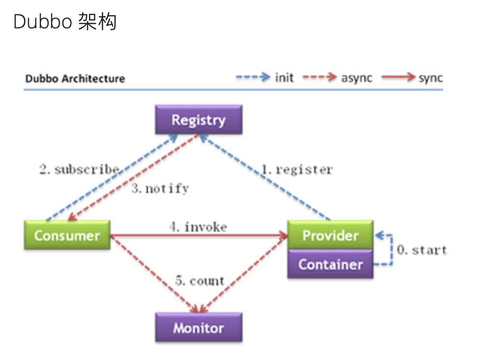

开篇明确阅读源码需要解决的疑问，带着问题驱动源码的阅读

 

## 版本

为了尽可能减少源码阅读代价，选用2.6.x版本

 

## 架构图

只关注provider、Consumer、Registry几个组件就行

 

## TODO LIST

- [ ] Consumer以执行本地方法的方式进行远程调用 实际承载调用的一定是代理对象 代理对象是怎么生成的 

- [ ] SPI机制
- [ ] Invoke扮演的角色
- [ ] URL