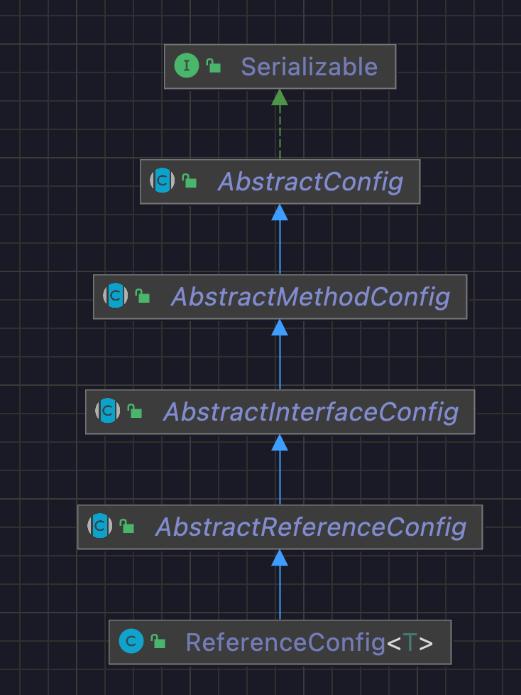
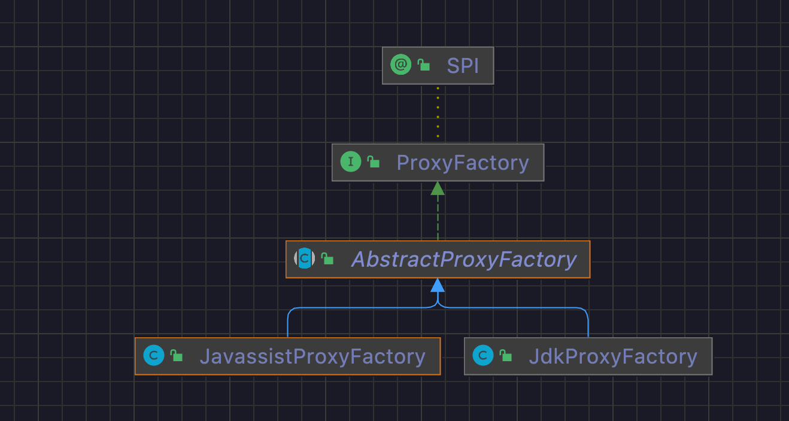

## 一 demo入口

```java
public class ApiConsumer {

    public static void main(String[] args) {
        // 当前应用配置
        ApplicationConfig application = new ApplicationConfig();
        application.setName("demo-consumer");

        // 连接注册中心配置
        RegistryConfig registry = new RegistryConfig();
        registry.setAddress("multicast://224.5.6.7:1234");

        // 引用远程服务 此实例很重，封装了与注册中心的连接以及与提供者的连接
        ReferenceConfig<DemoService> reference = new ReferenceConfig<DemoService>();
        reference.setApplication(application); // 配置应用信息
        reference.setRegistry(registry); // 配置注册中心信息
        reference.setInterface(DemoService.class); // 引用的远程服务的接口抽象

        // 和本地bean一样使用service 此代理对象内部封装了所有通讯细节 服务端获得了远程服务的代理对象 像调用本地方法一样
        DemoService demoService = reference.get();
        String ret = demoService.sayHello("world");
        System.out.println("--------------");
        System.out.println(ret);
    }
}
```

在跟踪ReferenceConfig<T>#get()方法之前 先熟悉一下这个类

仅仅调用了3个setxxx方法 本质几乎就是属性赋值

 

## 二 ReferenceConfig

### 1 类图结构



 


### 2 静态属性

```java
/**
 * {@link Protocol}的扩展
 *
 * filter=com.alibaba.dubbo.rpc.protocol.ProtocolFilterWrapper
 * listener=com.alibaba.dubbo.rpc.protocol.ProtocolListenerWrapper
 * mock=com.alibaba.dubbo.rpc.support.MockProtocol
 */
private static final Protocol refprotocol = ExtensionLoader.getExtensionLoader(Protocol.class).getAdaptiveExtension();

private static final Cluster cluster = ExtensionLoader.getExtensionLoader(Cluster.class).getAdaptiveExtension();

/**
 * 代理工厂
 */
private static final ProxyFactory proxyFactory = ExtensionLoader.getExtensionLoader(ProxyFactory.class).getAdaptiveExtension();
private final List<URL> urls = new ArrayList<URL>(); // 注册中心
```

涉及到ExtensionLoader的SPI扩展先跳过(todo)

 

### 3 构造方法

```java
public ReferenceConfig() {
}
```

构造方法中没有对属性做赋值操作

也就是说除了几个static修饰的静态属性做了赋值操作之外 其他属性均没有进行操作

 

### 4 ReferenceConfig#get()

```java
public synchronized T get() {
    if (this.destroyed) throw new IllegalStateException("Already destroyed!");
    if (this.ref == null)
        this.init(); // 远程服务的代理对象
    return ref;
}
```

说明在ReferenceConfig#init()方法执行期间 生成了服务的代理对象并完成了ReferenceConfig#ref属性赋值

 

### 5 ReferenceConfig#init()

```java
private void init() {
    if (initialized) return; // 判断是否已经完成远程服务的初始化
    initialized = true; // 标识完成远程服务的初始化
    if (interfaceName == null || interfaceName.length() == 0) // 大的原理肯定是基于接口进行反射代理 对必要参数进行校验
        throw new IllegalStateException("<dubbo:reference interface=\"\" /> interface not allow null!");
    // get consumer's global configuration
    checkDefault(); // 尝试配置ConsumerConfig
    appendProperties(this); // 尝试配置ReferenceConfig
    if (super.getGeneric() == null && this.getConsumer() != null) {
        super.setGeneric(this.getConsumer().getGeneric());
    }
    if (ProtocolUtils.isGeneric(super.getGeneric())) {
        this.interfaceClass = GenericService.class;
    } else {
        try {
            this.interfaceClass = Class.forName(interfaceName, true, Thread.currentThread().getContextClassLoader());
        } catch (ClassNotFoundException e) {
            throw new IllegalStateException(e.getMessage(), e);
        }
        super.checkInterfaceAndMethods(interfaceClass, this.methods); // 如果methods不为空 就校验interfaceClass是否存在对应的实现
    }
    String resolve = System.getProperty(interfaceName);
    String resolveFile = null;
    if (resolve == null || resolve.length() == 0) {
        resolveFile = System.getProperty("dubbo.resolve.file");
        if (resolveFile == null || resolveFile.length() == 0) {
            File userResolveFile = new File(new File(System.getProperty("user.home")), "dubbo-resolve.properties");
            if (userResolveFile.exists()) {
                resolveFile = userResolveFile.getAbsolutePath();
            }
        }
        if (resolveFile != null && resolveFile.length() > 0) {
            Properties properties = new Properties();
            FileInputStream fis = null;
            try {
                fis = new FileInputStream(new File(resolveFile));
                properties.load(fis);
            } catch (IOException e) {
                throw new IllegalStateException("Unload " + resolveFile + ", cause: " + e.getMessage(), e);
            } finally {
                try {
                    if (null != fis) fis.close();
                } catch (IOException e) {
                    logger.warn(e.getMessage(), e);
                }
            }
            resolve = properties.getProperty(interfaceName);
        }
    }
    if (resolve != null && resolve.length() > 0) {
        url = resolve;
        if (logger.isWarnEnabled()) {
            if (resolveFile != null) {
                logger.warn("Using default dubbo resolve file " + resolveFile + " replace " + interfaceName + "" + resolve + " to p2p invoke remote service.");
            } else {
                logger.warn("Using -D" + interfaceName + "=" + resolve + " to p2p invoke remote service.");
            }
        }
    }
    // 当前引用配置部分配置项如果缺失尝试把consumer的配置项赋值过来
    if (this.consumer != null) {
        if (this.application == null)
            this.application = this.consumer.getApplication();
        if (this.module == null)
            module = this.consumer.getModule();
        if (this.registries == null)
            registries = this.consumer.getRegistries();
        if (monitor == null)
            monitor = consumer.getMonitor();
    }
    if (this.module != null) {
        if (this.registries == null)
            this.registries = this.module.getRegistries();
        if (this.monitor == null)
            this.monitor = this.module.getMonitor();
    }
    if (this.application != null) {
        if (this.registries == null)
            this.registries = this.application.getRegistries();
        if (this.monitor == null)
            this.monitor = this.application.getMonitor();
    }
    super.checkApplication();
    checkStub(this.interfaceClass);
    checkMock(this.interfaceClass);
    Map<String, String> map = new HashMap<String, String>();
    Map<Object, Object> attributes = new HashMap<Object, Object>();
    map.put(Constants.SIDE_KEY, Constants.CONSUMER_SIDE);
    map.put(Constants.DUBBO_VERSION_KEY, Version.getProtocolVersion());
    map.put(Constants.TIMESTAMP_KEY, String.valueOf(System.currentTimeMillis()));
    if (ConfigUtils.getPid() > 0) {
        map.put(Constants.PID_KEY, String.valueOf(ConfigUtils.getPid()));
    }
    if (!super.isGeneric()) {
        String revision = Version.getVersion(interfaceClass, version);
        if (revision != null && revision.length() > 0) {
            map.put("revision", revision);
        }

        String[] methods = Wrapper.getWrapper(this.interfaceClass).getMethodNames(); // 远程服务接口中的方法定义
        if (methods.length == 0) {
            logger.warn("NO method found in service interface " + interfaceClass.getName());
            map.put("methods", Constants.ANY_VALUE);
        } else {
            map.put("methods", StringUtils.join(new HashSet<String>(Arrays.asList(methods)), ","));
        }
    }
    map.put(Constants.INTERFACE_KEY, interfaceName);
    appendParameters(map, this.application);
    appendParameters(map, module);
    appendParameters(map, consumer, Constants.DEFAULT_KEY);
    appendParameters(map, this);
    String prefix = StringUtils.getServiceKey(map); // com.alibaba.dubbo.demo.DemoService
    if (this.methods != null && !this.methods.isEmpty()) {
        for (MethodConfig method : methods) {
            appendParameters(map, method, method.getName());
            String retryKey = method.getName() + ".retry";
            if (map.containsKey(retryKey)) {
                String retryValue = map.remove(retryKey);
                if ("false".equals(retryValue)) {
                    map.put(method.getName() + ".retries", "0");
                }
            }
            appendAttributes(attributes, method, prefix + "." + method.getName());
            checkAndConvertImplicitConfig(method, map, attributes);
        }
    }

    String hostToRegistry = ConfigUtils.getSystemProperty(Constants.DUBBO_IP_TO_REGISTRY);
    if (hostToRegistry == null || hostToRegistry.length() == 0) {
        hostToRegistry = NetUtils.getLocalHost();
    } else if (isInvalidLocalHost(hostToRegistry)) {
        throw new IllegalArgumentException("Specified invalid registry ip from property:" + Constants.DUBBO_IP_TO_REGISTRY + ", value:" + hostToRegistry);
    }
    map.put(Constants.REGISTER_IP_KEY, hostToRegistry);

    //attributes are stored by system context.
    StaticContext.getSystemContext().putAll(attributes);
    /**
         * <p>map就是一个配置项 包含了远程服务的配置信息 根据配置信息构建远程服务的代理对象<ul>
         *     <li>side -> consumer</li>
         *     <li>application -> demo-service</li>
         *     <li>register.ip -> 192.168.0.3</li>
         *     <li>methods -> sayHello</li>
         *     <li>qos.port -> 33333</li>
         *     <li>dubbo -> 2.0.2</li>
         *     <li>pid -> 37888</li>
         *     <li>interface -> com.alibaba.dubbo.demo.DemoService</li>
         *     <li>timestamp -> 1652886744792</li>
         * </ul></p>
         */
    this.ref = this.createProxy(map);
    ConsumerModel consumerModel = new ConsumerModel(getUniqueServiceName(), this, ref, interfaceClass.getMethods());
    ApplicationModel.initConsumerModel(getUniqueServiceName(), consumerModel);
}
```

核心在于根据客户端传进来的配置项创建了代理对象

 

### 6 ReferenceConfig#createProxy()

```java
private T createProxy(Map<String, String> map) {
    URL tmpUrl = new URL("temp", "localhost", 0, map);
    final boolean isJvmRefer; // false
    if (super.isInjvm() == null) {
        if (this.url != null && this.url.length() > 0) { // if a url is specified, don't do local reference
            isJvmRefer = false;
        } else if (InjvmProtocol.getInjvmProtocol().isInjvmRefer(tmpUrl)) {
            // by default, reference local service if there is
            isJvmRefer = true;
        } else {
            isJvmRefer = false;
        }
    } else {
        isJvmRefer = isInjvm().booleanValue();
    }

    if (isJvmRefer) {
        URL url = new URL(Constants.LOCAL_PROTOCOL, NetUtils.LOCALHOST, 0, interfaceClass.getName()).addParameters(map);
        invoker = refprotocol.refer(interfaceClass, url);
        if (logger.isInfoEnabled()) {
            logger.info("Using injvm service " + interfaceClass.getName());
        }
    } else {
        if (this.url != null && this.url.length() > 0) { // user specified URL, could be peer-to-peer address, or register center's address.
            String[] us = Constants.SEMICOLON_SPLIT_PATTERN.split(url);
            if (us != null && us.length > 0) {
                for (String u : us) {
                    URL url = URL.valueOf(u);
                    if (url.getPath() == null || url.getPath().length() == 0) {
                        url = url.setPath(interfaceName);
                    }
                    if (Constants.REGISTRY_PROTOCOL.equals(url.getProtocol())) {
                        urls.add(url.addParameterAndEncoded(Constants.REFER_KEY, StringUtils.toQueryString(map)));
                    } else {
                        urls.add(ClusterUtils.mergeUrl(url, map));
                    }
                }
            }
        } else { // assemble URL from register center's configuration
            List<URL> us = super.loadRegistries(false);
            if (us != null && !us.isEmpty()) {
                for (URL u : us) {
                    URL monitorUrl = loadMonitor(u);
                    if (monitorUrl != null) {
                        map.put(Constants.MONITOR_KEY, URL.encode(monitorUrl.toFullString()));
                    }
                    this.urls.add(u.addParameterAndEncoded(Constants.REFER_KEY, StringUtils.toQueryString(map)));
                }
            }
            if (urls.isEmpty()) {
                throw new IllegalStateException("No such any registry to reference " + interfaceName + " on the consumer " + NetUtils.getLocalHost() + " use dubbo version " + Version.getVersion() + ", please config <dubbo:registry address=\"...\" /> to your spring config.");
            }
        }

        if (this.urls.size() == 1) {
            this.invoker = refprotocol.refer(interfaceClass, this.urls.get(0)); // 配置被封装在了URL中
        } else {
            List<Invoker<?>> invokers = new ArrayList<Invoker<?>>();
            URL registryURL = null;
            for (URL url : urls) {
                invokers.add(refprotocol.refer(interfaceClass, url));
                if (Constants.REGISTRY_PROTOCOL.equals(url.getProtocol())) {
                    registryURL = url; // use last registry url
                }
            }
            if (registryURL != null) { // registry url is available
                // use AvailableCluster only when register's cluster is available
                URL u = registryURL.addParameterIfAbsent(Constants.CLUSTER_KEY, AvailableCluster.NAME);
                invoker = cluster.join(new StaticDirectory(u, invokers));
            } else { // not a registry url
                invoker = cluster.join(new StaticDirectory(invokers));
            }
        }
    }

    Boolean c = super.check;
    if (c == null && this.consumer != null) {
        c = consumer.isCheck();
    }
    if (c == null) {
        c = true; // default true
    }
    if (c && !invoker.isAvailable()) {
        // make it possible for consumer to retry later if provider is temporarily unavailable
        initialized = false; // com.alibaba.dubbo.demo.DemoService
        final String serviceKey = (this.group == null ? "" : group + "/") + this.interfaceName + (this.version == null ? "" : ":" + this.version);
        Set<ConsumerInvokerWrapper> consumerInvoker = ProviderConsumerRegTable.getConsumerInvoker(serviceKey);
        if (consumerInvoker != Collections.<ConsumerInvokerWrapper>emptySet()) {
            //since create proxy error , so we must be the first consumer. Simply clear ConcurrentHashSet
            consumerInvoker.clear();
        }
        throw new IllegalStateException("Failed to check the status of the service " + interfaceName + ". No provider available for the service " + serviceKey + " from the url " + invoker.getUrl() + " to the consumer " + NetUtils.getLocalHost() + " use dubbo version " + Version.getVersion());
    }
    if (logger.isInfoEnabled()) {
        logger.info("Refer dubbo service " + interfaceClass.getName() + " from url " + invoker.getUrl());
    }
    // create service proxy
    return (T) proxyFactory.getProxy(invoker); // proxyFactory是该类的静态成员属性
}
```

这个方法中重要的概念有3个

- URL 封装了配置信息(todo)
- Invoker 实现了对网络通信的抽象封装 隐藏了具体的实现细节(todo)
- ProxyFactory 典型的工厂模式 负责创建具体的代理实例

先跳过URL和Invoker 将焦点集中在代理对象的创建上

 

### 7 ReferenceConfig#proxyFactory

```java
/**
* 代理工厂
*/
private static final ProxyFactory proxyFactory = ExtensionLoader.getExtensionLoader(ProxyFactory.class).getAdaptiveExtension();
```

dubbo的实现方案是自己设计了SPI机制

SPI功能扩展先跳过(todo)

 

该proxyFactory的具体实现是JavassistProxyFactory

 

## 三 JavassistProxyFactory

### 1 类图



典型的模板方法设计模式 将公共逻辑抽象在AbstractProxyFactory 具体的实现细节交给给自子类去关注

 

### 2 JavassistProxyFactory#getProxy()

```java
@Override
public <T> T getProxy(Invoker<T> invoker) throws RpcException {
    return this.getProxy(invoker, false);
}

@Override
public <T> T getProxy(Invoker<T> invoker, boolean generic) throws RpcException {
    Class<?>[] interfaces = null;
    /**
         * 配置项封装在{@link com.alibaba.dubbo.common.URL}之中
         */
    String config = invoker.getUrl().getParameter("interfaces"); //
    if (config != null && config.length() > 0) {
        String[] types = Constants.COMMA_SPLIT_PATTERN.split(config);
        if (types != null && types.length > 0) {
            interfaces = new Class<?>[types.length + 2];
            interfaces[0] = invoker.getInterface();
            interfaces[1] = EchoService.class;
            for (int i = 0; i < types.length; i++) {
                interfaces[i + 2] = ReflectUtils.forName(types[i]);
            }
        }
    }
    if (interfaces == null) {
        interfaces = new Class<?>[]{invoker.getInterface(), EchoService.class};
    }

    if (!invoker.getInterface().equals(GenericService.class) && generic) {
        int len = interfaces.length;
        Class<?>[] temp = interfaces;
        interfaces = new Class<?>[len + 1];
        System.arraycopy(temp, 0, interfaces, 0, len);
        interfaces[len] = GenericService.class;
    }

    return this.getProxy(invoker, interfaces);
}

@Override
@SuppressWarnings("unchecked")
public <T> T getProxy(Invoker<T> invoker, Class<?>[] interfaces) {
    /**
         * Proxy.getProxy()通过字节码技术生成了一个代理对象 暴露了一个newInstance()的方法 维护了一个InvocationHandler的属性
         * 因此这个地方一定是像代理对象中赋值了InvocationHandler属性
         * 后续调用该代理对象的方法是 实际是委托给了InvocationHandler进行处理
         */
    return (T) Proxy.getProxy(interfaces).newInstance(new InvokerInvocationHandler(invoker));
}
```

 这个方法分两个部分

- Proxy.getProxy()是通过工具类生成code 反射创建对象
- proxy.newInstance()

至此，消费方生成远程服务代理对象的主逻辑就结束了

 

## 四 总结

1. dubbo中使用了javassist字节码技术和反射创建对象的方式
2. 消费方根据配置的远程接口服务反射创建出代理对象
   - 维护了InvocationHandler属性
   - 开放了newInstance(InvocationHandler)方法
3. 代理对象接受到请求是将请求交给了InvokeHandler
4. InvokeHandler承担了网络通信的核心