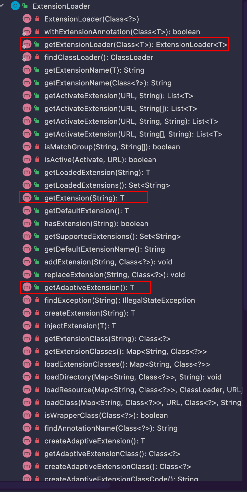

主要内容

- jdk spi
- dubbo spi

 

## 1 jdk spi

### 1.1 demo

```bash
.
├── src
│   ├── main
│   │   ├── java
│   │   │   └── com
│   │   │       └── alibaba
│   │   │           └── dubbo
│   │   │               └── demo
│   │   │                   └── spi
│   │   │                       └── jdk
│   │   │                           ├── JdkSpiClient.java               // 如何使用接口的实现
│   │   │                           └── service
│   │   │                               ├── JdkSpiService.java          // 接口抽象
│   │   │                               └── impl
│   │   │                                   ├── JdkSpiServiceImplA.java // 具体实现
│   │   │                                   └── JdkSpiServiceImplB.java // 具体实现
│   │   └── resources
│   │       └── META-INF
│   │           └── services
│   │               └── com.alibaba.dubbo.demo.spi.jdk.service.JdkSpiService  // 配置文件
└── tree.txt
```


#### 1.1.1 接口

```java
public interface JdkSpiService {

    String sayHello(String s);
}
```


#### 1.1.2 实现

```java
public class JdkSpiServiceImplA implements JdkSpiService {
    @Override
    public String sayHello(String s) {
        return "this is A, hello " + s;
    }
}
public class JdkSpiServiceImplB implements JdkSpiService {
    @Override
    public String sayHello(String s) {
        return "this is B, hello " + s;
    }
}
```


#### 1.1.3 classpath配置(META-INF/services/com.alibaba.dubbo.demo.spi.jdk.service.JdkSpiService)

```java
com.alibaba.dubbo.demo.spi.jdk.service.impl.JdkSpiServiceImplA
com.alibaba.dubbo.demo.spi.jdk.service.impl.JdkSpiServiceImplB
```


#### 1.1.4 调用

```java
public class JdkSpiClient {

    public static void main(String[] args) {
        ServiceLoader<JdkSpiService> services = ServiceLoader.load(JdkSpiService.class);
        /**
         * jdk内置工具类扫描出指定文件配置的所有实现
         * 扫描过程中将所有的实现都通过反射的技术实现实例化缓存起来
         */
        for (JdkSpiService s : services) {
            String ret = s.sayHello("world");
            System.out.println(ret);
        }
    }
}
```


### 1.2 源码分析

#### 1.2.1 ServiceLoader#load()

```java
public static <S> ServiceLoader<S> load(Class<S> service) {
    ClassLoader cl = Thread.currentThread().getContextClassLoader();
    return ServiceLoader.load(service, cl);
}
```


#### 1.2.2 ServiceLoader#load()

```java
public static <S> ServiceLoader<S> load(Class<S> service, ClassLoader loader)
{
    return new ServiceLoader<>(service, loader);
}
```


#### 1.2.3 ServiceLoader

```java
public final class ServiceLoader<S> implements Iterable<S>{

    public Iterator<S> iterator() {
        return new Iterator<S>() {

            Iterator<Map.Entry<String,S>> knownProviders
                = providers.entrySet().iterator();

            public boolean hasNext() {
                if (knownProviders.hasNext())
                    return true;
                return lookupIterator.hasNext();
            }

            public S next() {
                if (knownProviders.hasNext())
                    return knownProviders.next().getValue();
                return lookupIterator.next();
            }

            public void remove() {
                throw new UnsupportedOperationException();
            }

        };
        
        private class LazyIterator
        implements Iterator<S>
    {

        Class<S> service;
        ClassLoader loader;
        Enumeration<URL> configs = null;
        Iterator<String> pending = null;
        String nextName = null;

        private LazyIterator(Class<S> service, ClassLoader loader) {
            this.service = service;
            this.loader = loader;
        }

        private boolean hasNextService() {
            if (nextName != null) {
                return true;
            }
            if (configs == null) {
                try {
                    String fullName = PREFIX + service.getName();
                    if (loader == null)
                        configs = ClassLoader.getSystemResources(fullName);
                    else
                        configs = loader.getResources(fullName);
                } catch (IOException x) {
                    fail(service, "Error locating configuration files", x);
                }
            }
            while ((pending == null) || !pending.hasNext()) {
                if (!configs.hasMoreElements()) {
                    return false;
                }
                pending = parse(service, configs.nextElement());
            }
            nextName = pending.next();
            return true;
        }

        private S nextService() {
            if (!hasNextService())
                throw new NoSuchElementException();
            String cn = nextName;
            nextName = null;
            Class<?> c = null;
            try {
                c = Class.forName(cn, false, loader);
            } catch (ClassNotFoundException x) {
                fail(service,
                     "Provider " + cn + " not found");
            }
            if (!service.isAssignableFrom(c)) {
                fail(service,
                     "Provider " + cn  + " not a subtype");
            }
            try {
                S p = service.cast(c.newInstance());
                providers.put(cn, p);
                return p;
            } catch (Throwable x) {
                fail(service,
                     "Provider " + cn + " could not be instantiated",
                     x);
            }
            throw new Error();          // This cannot happen
        }

        public boolean hasNext() {
            if (acc == null) {
                return hasNextService();
            } else {
                PrivilegedAction<Boolean> action = new PrivilegedAction<Boolean>() {
                    public Boolean run() { return hasNextService(); }
                };
                return AccessController.doPrivileged(action, acc);
            }
        }

        public S next() {
            if (acc == null) {
                return nextService();
            } else {
                PrivilegedAction<S> action = new PrivilegedAction<S>() {
                    public S run() { return nextService(); }
                };
                return AccessController.doPrivileged(action, acc);
            }
        }

        public void remove() {
            throw new UnsupportedOperationException();
        }

    }
}
```

该类实现了Iterable也就是说支持增强for循环 通过内部类的方式实现了对迭代器的支持

轮询的时候触发对指定路径的classpath文件扫描META-INF/services/ 然后通过反射的方式创建实例

 

### 1.3 总结

1. 实现简单 jdk内置的工具类
2. 扫描过程中将所有的实现都功过反射方式实例化
3. 遍历的方式是通过迭代器 时间复杂度是O(N)
4. 动态实现类似策略模式需要自行设计一定的机制

 

## 2 dubbo spi

### 2.1 源码分析

核心实现都在ExtensionLoader中，比较重要的3个入口方法分别是

- ExtensionLoader#getExtensionLoader() 扩展实现的加载器
- ExtensionLoader#getAdaptiveExtension() 获取自适应扩展
- ExtensionLoader#getExtension() 根据指定的扩展名称获取对应的扩展实现



如下几个名词概念是我的个人理解

1. 扩展点 - 一个接口，也就是SPI的接口，通过@SPI注解标识，
2. 扩展实现 - SPI的接口具体实现，配置在classpath路径的文件中，提供给扩展加载器进行扫描
3. 自适应扩展实现 - 区别于jdk SPI的关键，目的是为了在运行时根据特定场景获取需要的扩展实现，这个机制的实现体现在@Adaptive这个注解，该注解可以作用于类和方法

- - @Adaptive作用于类 运行时自适应扩展类
  - @Adaptive作用于方法 运行时自适应扩展方法

 

#### 2.1.1 ExtensionLoader#getExtensionLoader()

```java
private final Class<?> type; // 扩展点(接口类型)

/**
 * {@link ExtensionFactory}的实例
 * 出了ExtensionFactory的ExtensionLoader这个属性为空 其他的扩展接口的扩展类加载器这个属性都是ExtensionFactory的实例
 *
 * 但是{@link ExtensionFactory}本身也是一个扩展接口
 *
 * classpath文件:
 * adaptive=com.alibaba.dubbo.common.extension.factory.AdaptiveExtensionFactory
 * spi=com.alibaba.dubbo.common.extension.factory.SpiExtensionFactory
 *
 * adaptive {@link com.alibaba.dubbo.common.extension.factory.AdaptiveExtensionFactory}会被赋值给{@link ExtensionLoader#cachedAdaptiveClass}
 * spi {@link com.alibaba.dubbo.common.extension.factory.SpiExtensionFactory}会作为扩展实现候选
 */
private final ExtensionFactory objectFactory;

/**
 * <p>给定接口<tt>type</tt>的扩展类加载器{@link ExtensionLoader}</p>
 */
@SuppressWarnings("unchecked")
public static <T> ExtensionLoader<T> getExtensionLoader(Class<T> type) {
    // 必要的参数校验
    if (type == null) throw new IllegalArgumentException("Extension type == null");
    // 是个接口
    ExtensionLoader<T> loader = (ExtensionLoader<T>) EXTENSION_LOADERS.get(type);
    if (loader == null) {
        EXTENSION_LOADERS.putIfAbsent(type, new ExtensionLoader<T>(type));
        loader = (ExtensionLoader<T>) EXTENSION_LOADERS.get(type);
    }
    return loader;
}

private ExtensionLoader(Class<?> type) {
    this.type = type;
    this.objectFactory = (type == ExtensionFactory.class ? null : ExtensionLoader.getExtensionLoader(ExtensionFactory.class).getAdaptiveExtension());
}
```

 这个方法逻辑很简单就是创建一个扩展点需要的一个实现加载器

 

#### 2.1.2 ExtensionLoader#getAdaptiveExtension()

```java
/**
     * <p>当前扩展接口的自适应扩展实现<ul>
     *     <li>取缓存</li>
     *     <li>创建扩展点的自适应扩展实现</li>
     *     <li>存缓存</li>
     * </ul></p>
     */
    @SuppressWarnings("unchecked")
    public T getAdaptiveExtension() {
        Object instance = cachedAdaptiveInstance.get();
        // 典型的synchronized DCL
        if (instance == null) {
            if (createAdaptiveInstanceError == null) {
                synchronized (cachedAdaptiveInstance) {
                    instance = cachedAdaptiveInstance.get();
                    if (instance == null) {
                        try {
                            instance = this.createAdaptiveExtension(); // 为扩展接口创建适配类
                            cachedAdaptiveInstance.set(instance); // 放缓存
                        } catch (Throwable t) {
                            createAdaptiveInstanceError = t;
                            throw new IllegalStateException("fail to create adaptive instance: " + t.toString(), t);
                        }
                    }
                }
            } else {
                throw new IllegalStateException("fail to create adaptive instance: " + createAdaptiveInstanceError.toString(), createAdaptiveInstanceError);
            }
        }

        return (T) instance;
    }

    /**
     * <p>依赖{@link ExtensionLoader}这个扩展实现加载器 为扩展点{@link ExtensionLoader#type}创建合适的自适应扩展实现</p> 
     */
    @SuppressWarnings("unchecked")
    private T createAdaptiveExtension() {
        try {
            /**
             * <p>3个方法<ul>
             *     <li>injectExtension() - 解决扩展实现的setter属性注入依赖的问题</li>
             *     <li>getAdaptiveExtensionClass() - 通过扩展加载器获取到扩展点的自适应扩展实现的java类</li>
             *     <li>newInstance() - jdk内置的{@link Class#newInstance()}方法反射创建实例</li>
             * </ul>
             * 其中 第2个方法是核心</p>
             */
            return this.injectExtension((T) this.getAdaptiveExtensionClass().newInstance());
        } catch (Exception e) {
            throw new IllegalStateException("Can not create adaptive extension " + type + ", cause: " + e.getMessage(), e);
        }
    }

    /**
     * <p>通过扩展加载器获取到扩展点的自适应扩展实现的java类<ul>
     *     <li>扫描配置的classpath的扩展实现候选</li>
     *     <li>如果候选实现中存在某个实现类是被{@link Adaptive}修饰的 就缓存起来 作为自适应扩展适配类</li>
     *     <li>code生成的方式对扩展点中被{@link Adaptive}修饰的方法进行编码 字节码技术生成类</li>
     * </ul></p>
     */
    private Class<?> getAdaptiveExtensionClass() {
        this.getExtensionClasses(); // 加载所有扩展接口指定的实现方式
        if (this.cachedAdaptiveClass != null) // 扫描加载落站实现的时候会将@Adaptive注解标识的实现缓存起来作为扩展适配的第一优先级
            return this.cachedAdaptiveClass;
        return this.cachedAdaptiveClass = this.createAdaptiveExtensionClass(); // 没有@Adaptive注解指定默认的扩展实现 使用编码技术生成
    }
```

代码可以看出找到扩展点需要的自适应扩展实现适配的类有2个方式

 

##### 1 扫描出自适应扩展适配类

```java
/**
     * META-INF/dubbo/internal/
     * META-INF/dubbo/
     * META-INF/services/
     *
     * 对上面3个路径进行扫描 找到扩展点(需要扩展的接口)的配置文件
     * 轮询配置文件里面的所有键值对(key=名称 value=扩展点的扩展实现)
     * 解析过程中
     *   如果扩展实现上注有{@link Adaptive}注解 就把这个实现缓存在{@link ExtensionLoader#cachedAdaptiveClass} 这个实现就是{@link ExtensionLoader#type}这个扩展点的自适应扩展实现适配类
     *   扩展实现是包装类 全部缓存到{@link ExtensionLoader#cachedWrapperClasses}
     *   其他扩展实现都缓存到{@link ExtensionLoader#cachedClasses}
     */
    private Map<String, Class<?>> getExtensionClasses() {
        Map<String, Class<?>> classes = cachedClasses.get();
        if (classes == null) {
            synchronized (cachedClasses) {
                classes = cachedClasses.get();
                if (classes == null) {
                    classes = this.loadExtensionClasses(); // 加载扩展实现类信息
                    this.cachedClasses.set(classes);
                }
            }
        }
        return classes;
    }

    // synchronized in getExtensionClasses
    private Map<String, Class<?>> loadExtensionClasses() {
        /**
         * <p>{@link javassist.util.proxy.ProxyFactory}这个扩展接口标注了注解{@link SPI} @SPI("javassist") 也就是说value()给定的是javassist</p>
         */
        final SPI defaultAnnotation = type.getAnnotation(SPI.class);
        if (defaultAnnotation != null) {
            String value = defaultAnnotation.value();
            if ((value = value.trim()).length() > 0) {
                String[] names = NAME_SEPARATOR.split(value);
                if (names.length > 1)
                    throw new IllegalStateException("more than 1 default extension name on extension " + type.getName() + ": " + Arrays.toString(names));
                if (names.length == 1) this.cachedDefaultName = names[0];
            }
        }

        Map<String, Class<?>> extensionClasses = new HashMap<String, Class<?>>();
        /**
         * <p>指定的3个classpath路径加上要扩展的接口的全限定名为最终路径 进行加载<ul>
         *     <li>META-INF/dubbo/internal/com.alibaba.dubbo.rpc.ProxyFactory</li>
         * </ul></p>
         */
        this.loadDirectory(extensionClasses, DUBBO_INTERNAL_DIRECTORY); // META-INF/dubbo/internal/
        this.loadDirectory(extensionClasses, DUBBO_DIRECTORY); // META-INF/dubbo/
        this.loadDirectory(extensionClasses, SERVICES_DIRECTORY); // META-INF/services/
        return extensionClasses;
    }

    private void loadDirectory(Map<String, Class<?>> extensionClasses, String dir) {
        String fileName = dir + type.getName();
        try {
            Enumeration<java.net.URL> urls;
            ClassLoader classLoader = this.findClassLoader();
            if (classLoader != null)
                urls = classLoader.getResources(fileName);
            else
                urls = ClassLoader.getSystemResources(fileName);
            if (urls != null) {
                while (urls.hasMoreElements()) {
                    java.net.URL resourceURL = urls.nextElement();
                    this.loadResource(extensionClasses, classLoader, resourceURL);
                }
            }
        } catch (Throwable t) {
            logger.error("Exception when load extension class(interface: " + type + ", description file: " + fileName + ").", t);
        }
    }

    private void loadResource(Map<String, Class<?>> extensionClasses, ClassLoader classLoader, java.net.URL resourceURL) {
        try {
            BufferedReader reader = new BufferedReader(new InputStreamReader(resourceURL.openStream(), "utf-8"));
            try {
                String line;
                while ((line = reader.readLine()) != null) {
                    final int ci = line.indexOf('#');
                    if (ci >= 0) line = line.substring(0, ci);
                    line = line.trim();
                    if (line.length() > 0) {
                        try {
                            String name = null;
                            int i = line.indexOf('=');
                            if (i > 0) {
                                name = line.substring(0, i).trim(); // 给扩展实现起的名字
                                line = line.substring(i + 1).trim(); // 扩展实现的类路径
                            }
                            if (line.length() > 0)
                                this.loadClass(extensionClasses, resourceURL, Class.forName(line, true, classLoader), name);
                        } catch (Throwable t) {
                            IllegalStateException e = new IllegalStateException("Failed to load extension class(interface: " + type + ", class line: " + line + ") in " + resourceURL + ", cause: " + t.getMessage(), t);
                            exceptions.put(line, e);
                        }
                    }
                }
            } finally {
                reader.close();
            }
        } catch (Throwable t) {
            logger.error("Exception when load extension class(interface: " + type + ", class file: " + resourceURL + ") in " + resourceURL, t);
        }
    }

    private void loadClass(Map<String, Class<?>> extensionClasses, java.net.URL resourceURL, Class<?> clazz, String name) throws NoSuchMethodException {
        if (!type.isAssignableFrom(clazz))
            throw new IllegalStateException("Error when load extension class(interface: " + type + ", class line: " + clazz.getName() + "), class " + clazz.getName() + "is not subtype of interface.");
        if (clazz.isAnnotationPresent(Adaptive.class)) { // 扩展实现上注有@Adaptive注解
            if (this.cachedAdaptiveClass == null) // 将标注了@Adaptive注解的实现缓存起来 作为第一优先级
                this.cachedAdaptiveClass = clazz;
            else if (!cachedAdaptiveClass.equals(clazz)) // 扩展实现中只能存在一个标注了@Adaptive注解的实现
                throw new IllegalStateException("More than 1 adaptive class found: " + cachedAdaptiveClass.getClass().getName() + ", " + clazz.getClass().getName());
        } else if (this.isWrapperClass(clazz)) { // 扩展实现是包装类
            Set<Class<?>> wrappers = this.cachedWrapperClasses;
            if (wrappers == null) {
                this.cachedWrapperClasses = new ConcurrentHashSet<Class<?>>();
                wrappers = this.cachedWrapperClasses;
            }
            wrappers.add(clazz);
        } else { // 其他的扩展实现
            clazz.getConstructor();
            if (name == null || name.length() == 0) {
                name = findAnnotationName(clazz);
                if (name.length() == 0)
                    throw new IllegalStateException("No such extension name for the class " + clazz.getName() + " in the config " + resourceURL);
            }
            String[] names = NAME_SEPARATOR.split(name);
            if (names != null && names.length > 0) {
                Activate activate = clazz.getAnnotation(Activate.class);
                if (activate != null)
                    this.cachedActivates.put(names[0], activate);
                for (String n : names) {
                    if (!this.cachedNames.containsKey(clazz)) cachedNames.put(clazz, n);
                    Class<?> c = extensionClasses.get(n);
                    if (c == null) {
                        extensionClasses.put(n, clazz);
                    } else if (c != clazz)
                        throw new IllegalStateException("Duplicate extension " + type.getName() + " name " + n + " on " + c.getName() + " and " + clazz.getName());
                }
            }
        }
    }
```

 

##### 2 生成code方式编译出自适应适配类

```java
    /**
     * <p>code生成的方式对扩展点中被{@link Adaptive}修饰的方法进行编码 字节码技术生成类</p>
     */
    private Class<?> createAdaptiveExtensionClass() {
        String code = this.createAdaptiveExtensionClassCode(); // 硬编码扩展接口的实现类(方法标注@Adaptive()注解的)
        ClassLoader classLoader = findClassLoader(); // 当前类加载器
        com.alibaba.dubbo.common.compiler.Compiler compiler = ExtensionLoader.getExtensionLoader(com.alibaba.dubbo.common.compiler.Compiler.class).getAdaptiveExtension();
        return compiler.compile(code, classLoader);
    }

    /**
     * <p>将扩展点{@link ExtensionLoader#type}中所有被{@link Adaptive}修饰的方法 生成编码</p>
     */
    private String createAdaptiveExtensionClassCode() {
        StringBuilder codeBuilder = new StringBuilder();
        Method[] methods = type.getMethods();
        boolean hasAdaptiveAnnotation = false;
        // 扩展点接口完全没有@Adaptive标注的方法 就不需要生成扩展类
        for (Method m : methods) {
            if (m.isAnnotationPresent(Adaptive.class)) {
                hasAdaptiveAnnotation = true;
                break;
            }
        }
        // no need to generate adaptive class since there's no adaptive method found.
        if (!hasAdaptiveAnnotation)
            throw new IllegalStateException("No adaptive method on extension " + type.getName() + ", refuse to create the adaptive class!");

        codeBuilder.append("package ").append(type.getPackage().getName()).append(";");
        codeBuilder.append("\nimport ").append(ExtensionLoader.class.getName()).append(";");
        codeBuilder.append("\npublic class ").append(type.getSimpleName()).append("$Adaptive").append(" implements ").append(type.getCanonicalName()).append(" {");

        for (Method method : methods) { // 轮询扩展点里面所有的方法
            Class<?> rt = method.getReturnType(); // 方法的返回值类型
            Class<?>[] pts = method.getParameterTypes(); // 方法的入参类型
            Class<?>[] ets = method.getExceptionTypes(); // 方法的异常类型

            Adaptive adaptiveAnnotation = method.getAnnotation(Adaptive.class);
            StringBuilder code = new StringBuilder(512);
            if (adaptiveAnnotation == null) {
                code.append("throw new UnsupportedOperationException(\"method ").append(method.toString()).append(" of interface ").append(type.getName()).append(" is not adaptive method!\");");
            } else {
                int urlTypeIndex = -1; // 标识方法参数列表中是否有URL类型的行参 或者虽然行参不是直接URL类型但是这个类型有getxxx的方法可以返回URL -1表示不存在
                for (int i = 0; i < pts.length; ++i) { // 轮询方法参数列表 记下URL类型的参数数组脚标 因为URL封装了所有的配置信息
                    if (pts[i].equals(URL.class)) {
                        urlTypeIndex = i;
                        break;
                    }
                }
                // found parameter in URL type
                if (urlTypeIndex != -1) { // 有参数类型为URL的方法
                    // Null Point check
                    String s = String.format("\nif (arg%d == null) throw new IllegalArgumentException(\"url == null\");", urlTypeIndex);
                    code.append(s);

                    s = String.format("\n%s url = arg%d;", URL.class.getName(), urlTypeIndex);
                    code.append(s);
                }
                // did not find parameter in URL type
                else { // 没有参数类型是URL类型的方法
                    String attribMethod = null;

                    // find URL getter method // 轮询所有的参数类型 但凡找到一个getxxx的getter方法的返回值是URL类型就标识出来 如果压根不存在这样的一个获取URL的getter方法 那就无法创建自适应扩展实现的编码 因为所有的配置信息都封装在URL中 没有URL就无法在运行时进行自适应扩展
                    LBL_PTS:
                    for (int i = 0; i < pts.length; ++i) {
                        Method[] ms = pts[i].getMethods(); // 行参也是个类型 这个类型的方法列表
                        for (Method m : ms) {
                            String name = m.getName();
                            if ((name.startsWith("get") || name.length() > 3)
                                    && Modifier.isPublic(m.getModifiers())
                                    && !Modifier.isStatic(m.getModifiers())
                                    && m.getParameterTypes().length == 0
                                    && m.getReturnType() == URL.class) {
                                urlTypeIndex = i;
                                attribMethod = name;
                                break LBL_PTS;
                            }
                        }
                    }
                    if (attribMethod == null) throw new IllegalStateException("fail to create adaptive class for interface " + type.getName() + ": not found url parameter or url attribute in parameters of method " + method.getName());

                    // Null point check
                    String s = String.format("\nif (arg%d == null) throw new IllegalArgumentException(\"%s argument == null\");", urlTypeIndex, pts[urlTypeIndex].getName());
                    code.append(s);
                    s = String.format("\nif (arg%d.%s() == null) throw new IllegalArgumentException(\"%s argument %s() == null\");", urlTypeIndex, attribMethod, pts[urlTypeIndex].getName(), attribMethod);
                    code.append(s);

                    s = String.format("%s url = arg%d.%s();", URL.class.getName(), urlTypeIndex, attribMethod);
                    code.append(s);
                }
                // @Adaptive的value()属性
                String[] value = adaptiveAnnotation.value();
                // value is not set, use the value generated from class name as the key
                if (value.length == 0) {
                    char[] charArray = this.type.getSimpleName().toCharArray(); // 扩展点的名称
                    StringBuilder sb = new StringBuilder(128);
                    for (int i = 0; i < charArray.length; i++) {
                        if (Character.isUpperCase(charArray[i])) {
                            if (i != 0) sb.append(".");
                            sb.append(Character.toLowerCase(charArray[i]));
                        } else {
                            sb.append(charArray[i]);
                        }
                    }
                    value = new String[]{sb.toString()};
                }

                boolean hasInvocation = false;
                for (int i = 0; i < pts.length; ++i) {
                    if (pts[i].getName().equals("com.alibaba.dubbo.rpc.Invocation")) {
                        // Null Point check
                        String s = String.format("\nif (arg%d == null) throw new IllegalArgumentException(\"invocation == null\");", i);
                        code.append(s);
                        s = String.format("\nString methodName = arg%d.getMethodName();", i);
                        code.append(s);
                        hasInvocation = true;
                        break;
                    }
                }

                String defaultExtName = cachedDefaultName;
                String getNameCode = null;
                for (int i = value.length - 1; i >= 0; --i) {
                    if (i == value.length - 1) {
                        if (null != defaultExtName) {
                            if (!"protocol".equals(value[i]))
                                if (hasInvocation)
                                    getNameCode = String.format("url.getMethodParameter(methodName, \"%s\", \"%s\")", value[i], defaultExtName);
                                else
                                    getNameCode = String.format("url.getParameter(\"%s\", \"%s\")", value[i], defaultExtName);
                            else
                                getNameCode = String.format("( url.getProtocol() == null ? \"%s\" : url.getProtocol() )", defaultExtName);
                        } else {
                            if (!"protocol".equals(value[i]))
                                if (hasInvocation)
                                    getNameCode = String.format("url.getMethodParameter(methodName, \"%s\", \"%s\")", value[i], defaultExtName);
                                else
                                    getNameCode = String.format("url.getParameter(\"%s\")", value[i]);
                            else
                                getNameCode = "url.getProtocol()";
                        }
                    } else {
                        if (!"protocol".equals(value[i]))
                            if (hasInvocation)
                                getNameCode = String.format("url.getMethodParameter(methodName, \"%s\", \"%s\")", value[i], defaultExtName);
                            else
                                getNameCode = String.format("url.getParameter(\"%s\", %s)", value[i], getNameCode);
                        else
                            getNameCode = String.format("url.getProtocol() == null ? (%s) : url.getProtocol()", getNameCode);
                    }
                }
                code.append("\nString extName = ").append(getNameCode).append(";");
                // check extName == null?
                String s = String.format("\nif(extName == null) " + "throw new IllegalStateException(\"Fail to get extension(%s) name from url(\" + url.toString() + \") use keys(%s)\");", type.getName(), Arrays.toString(value));
                code.append(s);

                // 核心 根据dubbo SPI扩展方式获取扩展点的自适应扩展实现
                s = String.format("\n%s extension = (%<s)%s.getExtensionLoader(%s.class).getExtension(extName);", type.getName(), ExtensionLoader.class.getSimpleName(), type.getName());
                code.append(s);

                // return statement
                if (!rt.equals(void.class)) {
                    code.append("\nreturn ");
                }

                s = String.format("extension.%s(", method.getName());
                code.append(s);
                for (int i = 0; i < pts.length; i++) {
                    if (i != 0)
                        code.append(", ");
                    code.append("arg").append(i);
                }
                code.append(");");
            }

            codeBuilder.append("\npublic ").append(rt.getCanonicalName()).append(" ").append(method.getName()).append("(");
            for (int i = 0; i < pts.length; i++) {
                if (i > 0) {
                    codeBuilder.append(", ");
                }
                codeBuilder.append(pts[i].getCanonicalName());
                codeBuilder.append(" ");
                codeBuilder.append("arg").append(i);
            }
            codeBuilder.append(")");
            if (ets.length > 0) {
                codeBuilder.append(" throws ");
                for (int i = 0; i < ets.length; i++) {
                    if (i > 0) {
                        codeBuilder.append(", ");
                    }
                    codeBuilder.append(ets[i].getCanonicalName());
                }
            }
            codeBuilder.append(" {");
            codeBuilder.append(code.toString());
            codeBuilder.append("\n}");
        }
        codeBuilder.append("\n}");
        if (logger.isDebugEnabled()) {
            logger.debug(codeBuilder.toString());
        }
        return codeBuilder.toString();
    }
```

代码逻辑不复杂，实现起来比较偏细节，本质就是轮询扩展点的方法，生成code

 

#### 2.1.3 ExtensionLoader#getExtension()

```java
    public T getExtension(String name) {
        if (name == null || name.length() == 0) throw new IllegalArgumentException("Extension name == null");
        if ("true".equals(name)) return getDefaultExtension();
        Holder<Object> holder = this.cachedInstances.get(name);
        if (holder == null) {
            cachedInstances.putIfAbsent(name, new Holder<Object>());
            holder = cachedInstances.get(name);
        }
        Object instance = holder.get();
        if (instance == null) {
            synchronized (holder) {
                instance = holder.get();
                if (instance == null) {
                    instance = this.createExtension(name); // 缓存里面没有就去扫描里面找
                    holder.set(instance);
                }
            }
        }
        return (T) instance;
    }

    private T createExtension(String name) {
        Class<?> clazz = this.getExtensionClasses().get(name); // 扫描classpath扩展实现的候选 类信息拿到了通过反射拿实例
        if (clazz == null) throw findException(name);
        try {
            T instance = (T) EXTENSION_INSTANCES.get(clazz);
            if (instance == null) {
                EXTENSION_INSTANCES.putIfAbsent(clazz, clazz.newInstance());
                instance = (T) EXTENSION_INSTANCES.get(clazz);
            }
            injectExtension(instance); // 防止setter注入扩展的场景
            Set<Class<?>> wrapperClasses = cachedWrapperClasses;
            if (wrapperClasses != null && !wrapperClasses.isEmpty()) {
                for (Class<?> wrapperClass : wrapperClasses)
                    instance = injectExtension((T) wrapperClass.getConstructor(type).newInstance(instance));
            }
            return instance;
        } catch (Throwable t) {
            throw new IllegalStateException("Extension instance(name: " + name + ", class: " + type + ")  could not be instantiated: " + t.getMessage(), t);
        }
    }
```

 

### 2.2 总结

1. 扩展点是使用@SPI注解标识的接口，接口中方法可以有@Adaptive标识，也可以没有
2. dubbo提供SPI实现的核心工具类是ExtensionLoader
3. 为扩展点提供的实现是自适应扩展适配类的对象实例，而这个自适应适配类可能是写在classpath扫描文件的一个具体实现，也有可能没有提供这样一个实现转而通过对扩展点里面的@Adaptive提供的扩展方法生成的code编码编译反射出来的对象
4. 拿到了扩展点的自适应扩展实现对象之后，一般就会有2种情况，3种玩法

- - 对象是从扫描候选对象来的
    - 方法实现简简单单
    - 方法实现里面调用了ExetionLoader#getExtension()根据扩展名再次找实现，类似于工厂设计模式
  - 对象是根据生成code来的 生成code的时候就已经根据@SPi和@Adaptive的注解属性已经方法行参生成了扩展回调的钩子

 

## 3 dubbo spi例子

再多的阐述都是很苍白的，远没有实际的例子来得直观

### 3.1 Compiler扩展适配

```java
/**
 * <p>{@link Compiler}扩展点类上标注了{@link sun.security.provider.ConfigFile.Spi} 并且注解的{@link SPI#value()}的值是javassist 方法级别没有{@link com.alibaba.dubbo.common.extension.Adaptive}</p>
 * <p>classpath配置了3个实现 并且有注有{@link com.alibaba.dubbo.common.extension.Adaptive}的实现 因此这个实现被选为扩展实现<ul>
 *     <li>adaptive=com.alibaba.dubbo.common.compiler.support.AdaptiveCompiler</li>
 *     <li>jdk=com.alibaba.dubbo.common.compiler.support.JdkCompiler</li>
 *     <li>javassist=com.alibaba.dubbo.common.compiler.support.JavassistCompiler</li>
 * </ul></p>
 * <p>扩展点的实现为{@link com.alibaba.dubbo.common.compiler.support.AdaptiveCompiler}</p>
 * @since 2022/5/19
 * @author dingrui
 */
public class CompilerTest {

    public static void main(String[] args) {
        ExtensionLoader<Compiler> extensionLoader = ExtensionLoader.getExtensionLoader(Compiler.class);
        Compiler adaptiveExtension = extensionLoader.getAdaptiveExtension();
        System.out.println(adaptiveExtension);
    }
}
package com.alibaba.dubbo.common.compiler;

@SPI("javassist")
public interface Compiler {

    /**
     * Compile java source code.
     *
     * @param code        Java source code
     * @param classLoader classloader
     * @return Compiled class
     */
    Class<?> compile(String code, ClassLoader classLoader);

}
```

 分析思路

1 看扩展点，Compiler这个扩展点只有一个方法，没有使用@Adaptive，也就是说没办法通过生成code的方式生成自适应扩展对象，那么一定是从配置的实现候选里面选出来的

2 看实现的配置文件，Compile这个接口的package是com.alibaba.dubbo.common.compiler，找到dubbo工程的dubbo-common模块的classpath:META-INF/dubbo/internal/com.alibaba.dubbo.common.compiler这个文件，里面内容如下``

```
adaptive=com.alibaba.dubbo.common.compiler.support.AdaptiveCompiler
jdk=com.alibaba.dubbo.common.compiler.support.JdkCompiler
javassist=com.alibaba.dubbo.common.compiler.support.JavassistCompiler
```

里面的第一个实现类就是被@Adaptive注解标识了，因此这个类的实例对象就是Compiler的自适应扩展实现

3 看下这个类实现的接口方法逻辑

```java
    /**
     * <p>{@link Compiler}扩展点类上标注了{@link sun.security.provider.ConfigFile.Spi} 并且注解的{@link SPI#value()}的值是javassist 方法级别没有{@link com.alibaba.dubbo.common.extension.Adaptive}</p>
     * <p>classpath配置了3个实现 并且有注有{@link com.alibaba.dubbo.common.extension.Adaptive}的实现 因此这个实现被选为扩展实现<ul>
     *  <li>adaptive=com.alibaba.dubbo.common.compiler.support.AdaptiveCompiler</li>
     *  <li>jdk=com.alibaba.dubbo.common.compiler.support.JdkCompiler</li>
     *  <li>javassist=com.alibaba.dubbo.common.compiler.support.JavassistCompiler</li>
     * </ul></p>
     * <p>扩展点的自适应实现为{@link com.alibaba.dubbo.common.compiler.support.AdaptiveCompiler}</p>
     *
     * <p>但是调用这个方法的时候并不是直接使用某个解析器进行解析 而是实现了类似工厂模式的工厂类 根据扩展名称<tt>name</tt>获取真正的扩展实现{@link Compiler}</p> 这个name开放了api赋值可以从外部设置进来 也可以使用默认的(扩展点上{@link Compiler}的注解属性{@link SPI#value()}就是默认扩展名)
     */
    @Override
    public Class<?> compile(String code, ClassLoader classLoader) {
        Compiler compiler;
        ExtensionLoader<Compiler> loader = ExtensionLoader.getExtensionLoader(Compiler.class);
        String name = DEFAULT_COMPILER; // copy reference
        if (name != null && name.length() > 0) {
            compiler = loader.getExtension(name);
        } else {
            compiler = loader.getDefaultExtension();
        }
        return compiler.compile(code, classLoader);
    }
```

 在实现类的compile()方法内部会根据扩展名获取到真正的实现


### 3.2 ExtensionFactory扩展适配

```java
/**
 * <p>{@link ExtensionFactory}这个扩展点只在类上标识了{@link com.alibaba.dubbo.common.extension.SPI}注解 方法级别没有{@link com.alibaba.dubbo.common.extension.Adaptive}</p>
 * <p>因此在classpath配置文件里的扩展实现上一定有一个实现类是标注了{@link com.alibaba.dubbo.common.extension.Adaptive}的<ul>
 *     <li>adaptive=com.alibaba.dubbo.common.extension.factory.AdaptiveExtensionFactory</li>
 *     <li>spi=com.alibaba.dubbo.common.extension.factory.SpiExtensionFactory</li>
 * </ul></p>
 * <p>所以自适应扩展点的实现是{@link com.alibaba.dubbo.common.extension.factory.AdaptiveExtensionFactory}</p>
 * @since 2022/5/19
 * @author dingrui
 */
public class ExtensionFactoryTest {

    public static void main(String[] args) {
        ExtensionLoader<ExtensionFactory> extensionLoader = ExtensionLoader.getExtensionLoader(ExtensionFactory.class);
        ExtensionFactory obj = extensionLoader.getAdaptiveExtension();
        System.out.println(obj);
    }
}
```

分析思路

1 看扩展点，扩展点只有一个方法，并且没有标注@Adaptive注解，说明这个扩展点的自适应实现一定是从配置文件里面选出来的

```java
package com.alibaba.dubbo.common.extension;

/**
 * ExtensionFactory
 */
@SPI
public interface ExtensionFactory {

    /**
     * Get extension.
     *
     * @param type object type.
     * @param name object name.
     * @return object instance.
     */
    <T> T getExtension(Class<T> type, String name);

}
```

2 看配置文件的实现，根据扩展点package找到配置文件com.alibaba.dubbo.common.extension

```java
adaptive=com.alibaba.dubbo.common.extension.factory.AdaptiveExtensionFactory
spi=com.alibaba.dubbo.common.extension.factory.SpiExtensionFactory
```

3 其中第一个实现类是被@Adaptive注解修饰的，因此这个类就是扩展点的自适应扩展适配类

```java
@Adaptive
public class AdaptiveExtensionFactory implements ExtensionFactory {

    private final List<ExtensionFactory> factories;

    public AdaptiveExtensionFactory() {
        ExtensionLoader<ExtensionFactory> loader = ExtensionLoader.getExtensionLoader(ExtensionFactory.class);
        List<ExtensionFactory> list = new ArrayList<ExtensionFactory>();
        for (String name : loader.getSupportedExtensions()) {
            list.add(loader.getExtension(name));
        }
        factories = Collections.unmodifiableList(list);
    }

    @Override
    public <T> T getExtension(Class<T> type, String name) {
        for (ExtensionFactory factory : factories) {
            T extension = factory.getExtension(type, name);
            if (extension != null) {
                return extension;
            }
        }
        return null;
    }

}
```


### 3.3 Protocol扩展适配

```java
/**
 * <p>{@link Protocol}扩展点标注有{@link com.alibaba.dubbo.common.extension.SPI}注解 并且{@link SPI#value()}属性为dubbo 而且扩展点有两个方法被{@link com.alibaba.dubbo.common.extension.Adaptive}标注</p>
 * <p>classpath配置的扩展实现候选有<ul>
 *     <li>filter=com.alibaba.dubbo.rpc.protocol.ProtocolFilterWrapper</li>
 *     <li>listener=com.alibaba.dubbo.rpc.protocol.ProtocolListenerWrapper</li>
 *     <li>mock=com.alibaba.dubbo.rpc.support.MockProtocol</li>
 * </ul>
 * 这3个实现不存在被{@link com.alibaba.dubbo.common.extension.Adaptive}标注的类 有2个是包装类</p>
 * 因此这个扩展点的自适应扩展实现是通过字节码编码反射方式创建出来的对象
 * @since 2022/5/19
 * @author dingrui
 */
public class ProtocolTest {

    public static void main(String[] args) {
        ExtensionLoader<Protocol> extensionLoader = ExtensionLoader.getExtensionLoader(Protocol.class);
        Protocol refprotocol = extensionLoader.getAdaptiveExtension();
        System.out.println(refprotocol);
    }
}
```

分析思路

1 看扩展点，接口被@SPI注解修饰，并且value属性为dubbo，其中有2个方法被@Adaptive修饰，以上信息反映两个信息

- 它的自适应扩展实现可能是在配置文件中指定的@Adaptive实现
  - 在实现逻辑中不再需要SPI扩展
  - 大概率在实现中通过SPI根据扩展名获取真正的扩展点实现，扩展名的默认名称是通过这个@SPI注解传进来的dubbo
- 它的自适应扩展实现是通过生成code的方式，实现了这个接口中被@Adaptive修饰的2个方法，然后在方法中通过URL配置传进来的配置项进行获取真正的扩展点，URL配置key是硬编码的protocol，不存在配置值是使用@SPI传进来的dubbo

```java
/*
 * Licensed to the Apache Software Foundation (ASF) under one or more
 * contributor license agreements.  See the NOTICE file distributed with
 * this work for additional information regarding copyright ownership.
 * The ASF licenses this file to You under the Apache License, Version 2.0
 * (the "License"); you may not use this file except in compliance with
 * the License.  You may obtain a copy of the License at
 *
 *     http://www.apache.org/licenses/LICENSE-2.0
 *
 * Unless required by applicable law or agreed to in writing, software
 * distributed under the License is distributed on an "AS IS" BASIS,
 * WITHOUT WARRANTIES OR CONDITIONS OF ANY KIND, either express or implied.
 * See the License for the specific language governing permissions and
 * limitations under the License.
 */
package com.alibaba.dubbo.rpc;

import com.alibaba.dubbo.common.URL;
import com.alibaba.dubbo.common.extension.Adaptive;
import com.alibaba.dubbo.common.extension.SPI;

/**
 * Protocol. (API/SPI, Singleton, ThreadSafe)
 */
@SPI("dubbo")
public interface Protocol {

    /**
     * Get default port when user doesn't config the port.
     *
     * @return default port
     */
    int getDefaultPort();

    /**
     * Export service for remote invocation: <br>
     * 1. Protocol should record request source address after receive a request:
     * RpcContext.getContext().setRemoteAddress();<br>
     * 2. export() must be idempotent, that is, there's no difference between invoking once and invoking twice when
     * export the same URL<br>
     * 3. Invoker instance is passed in by the framework, protocol needs not to care <br>
     *
     * @param <T>     Service type
     * @param invoker Service invoker
     * @return exporter reference for exported service, useful for unexport the service later
     * @throws RpcException thrown when error occurs during export the service, for example: port is occupied
     */
    @Adaptive
    <T> Exporter<T> export(Invoker<T> invoker) throws RpcException;

    /**
     * Refer a remote service: <br>
     * 1. When user calls `invoke()` method of `Invoker` object which's returned from `refer()` call, the protocol
     * needs to correspondingly execute `invoke()` method of `Invoker` object <br>
     * 2. It's protocol's responsibility to implement `Invoker` which's returned from `refer()`. Generally speaking,
     * protocol sends remote request in the `Invoker` implementation. <br>
     * 3. When there's check=false set in URL, the implementation must not throw exception but try to recover when
     * connection fails.
     *
     * @param <T>  Service type
     * @param type Service class
     * @param url  URL address for the remote service
     * @return invoker service's local proxy
     * @throws RpcException when there's any error while connecting to the service provider
     */
    @Adaptive
    <T> Invoker<T> refer(Class<T> type, URL url) throws RpcException;

    /**
     * Destroy protocol: <br>
     * 1. Cancel all services this protocol exports and refers <br>
     * 2. Release all occupied resources, for example: connection, port, etc. <br>
     * 3. Protocol can continue to export and refer new service even after it's destroyed.
     */
    void destroy();

}
```

2 看配置文件的实现，到package com.alibaba.dubbo.rpc这个包里面找

```java
filter=com.alibaba.dubbo.rpc.protocol.ProtocolFilterWrapper
listener=com.alibaba.dubbo.rpc.protocol.ProtocolListenerWrapper
mock=com.alibaba.dubbo.rpc.support.MockProtocol
```

3 这3个实现都没有被@Adaptive注解修饰

4 通过生成code方式

```java
package com.alibaba.dubbo.rpc;
import com.alibaba.dubbo.common.extension.ExtensionLoader;
public class Protocol$Adaptive implements com.alibaba.dubbo.rpc.Protocol {
    public void destroy() {throw new UnsupportedOperationException("method public abstract void com.alibaba.dubbo.rpc.Protocol.destroy() of interface com.alibaba.dubbo.rpc.Protocol is not adaptive method!");
    }
    public int getDefaultPort() {throw new UnsupportedOperationException("method public abstract int com.alibaba.dubbo.rpc.Protocol.getDefaultPort() of interface com.alibaba.dubbo.rpc.Protocol is not adaptive method!");
    }
    public com.alibaba.dubbo.rpc.Exporter export(com.alibaba.dubbo.rpc.Invoker arg0) throws com.alibaba.dubbo.rpc.RpcException {
        if (arg0 == null) throw new IllegalArgumentException("com.alibaba.dubbo.rpc.Invoker argument == null");
        if (arg0.getUrl() == null) throw new IllegalArgumentException("com.alibaba.dubbo.rpc.Invoker argument getUrl() == null");com.alibaba.dubbo.common.URL url = arg0.getUrl();
        String extName = ( url.getProtocol() == null ? "dubbo" : url.getProtocol() );
        if(extName == null) throw new IllegalStateException("Fail to get extension(com.alibaba.dubbo.rpc.Protocol) name from url(" + url.toString() + ") use keys([protocol])");
        com.alibaba.dubbo.rpc.Protocol extension = (com.alibaba.dubbo.rpc.Protocol)ExtensionLoader.getExtensionLoader(com.alibaba.dubbo.rpc.Protocol.class).getExtension(extName);
        return extension.export(arg0);
    }
    public com.alibaba.dubbo.rpc.Invoker refer(java.lang.Class arg0, com.alibaba.dubbo.common.URL arg1) throws com.alibaba.dubbo.rpc.RpcException {
        if (arg1 == null) throw new IllegalArgumentException("url == null");
        com.alibaba.dubbo.common.URL url = arg1;
        String extName = ( url.getProtocol() == null ? "dubbo" : url.getProtocol() );
        if(extName == null) throw new IllegalStateException("Fail to get extension(com.alibaba.dubbo.rpc.Protocol) name from url(" + url.toString() + ") use keys([protocol])");
        com.alibaba.dubbo.rpc.Protocol extension = (com.alibaba.dubbo.rpc.Protocol)ExtensionLoader.getExtensionLoader(com.alibaba.dubbo.rpc.Protocol.class).getExtension(extName);
        return extension.refer(arg0, arg1);
    }
}
```

 5 代码实现逻辑，很轻易的可以看到通过URL携带的配置项获取真正的扩展点，如果URL中没有携带protocol这个配置项，就使用扩展点上@SPI注解value属性传进来的dubbo作为默认扩展点

 

### 3.4 ProxyFactory扩展适配

```java
/**
 * <p>{@link ProxyFactory}扩展点被{@link com.alibaba.dubbo.common.extension.SPI}标注 {@link SPI#value()}属性为javassist 该扩展点的方法都被{@link com.alibaba.dubbo.common.extension.Adaptive}修饰</p>
 * <p>扩展实现候选为<ul>
 *     <li>stub=com.alibaba.dubbo.rpc.proxy.wrapper.StubProxyFactoryWrapper</li>
 *     <li>jdk=com.alibaba.dubbo.rpc.proxy.jdk.JdkProxyFactory</li>
 *     <li>javassist=com.alibaba.dubbo.rpc.proxy.javassist.JavassistProxyFactory</li>
 * </ul></p>
 * <p>自适应扩展实现的选取步骤为<ul>
 *     <li>首先候选列表中没有标注{@link com.alibaba.dubbo.common.extension.Adaptive}的类</li>
 *     <li>生成code</li>
 * </ul></p>
 * @since 2022/5/19
 * @author dingrui
 */
public class ProxyFactoryTest {

    public static void main(String[] args) {
        ExtensionLoader<ProxyFactory> extensionLoader = ExtensionLoader.getExtensionLoader(ProxyFactory.class);
        ProxyFactory proxyFactory = extensionLoader.getAdaptiveExtension();
        System.out.println(proxyFactory);

        ProxyFactory extension = (ProxyFactory) extensionLoader.getExtension("javassist");
        System.out.println(extension);
    }
}
```

分析思路

1 看扩展点，扩展接口被@SPI注解标识，value属性是javassist，总共3个方法，都被@Adaptive标识，而且注解属性Contants.PROXY_KEY就是proxy；由此可以推测，这个接口的自适应适配类是通过生成code的方式，然后在实现方法过程中尝试从URL配置项中获取扩展点名称，没有指定名称，就使用这个@SPI注解传进去的javassist作为默认扩展点名称

```java
/*
 * Licensed to the Apache Software Foundation (ASF) under one or more
 * contributor license agreements.  See the NOTICE file distributed with
 * this work for additional information regarding copyright ownership.
 * The ASF licenses this file to You under the Apache License, Version 2.0
 * (the "License"); you may not use this file except in compliance with
 * the License.  You may obtain a copy of the License at
 *
 *     http://www.apache.org/licenses/LICENSE-2.0
 *
 * Unless required by applicable law or agreed to in writing, software
 * distributed under the License is distributed on an "AS IS" BASIS,
 * WITHOUT WARRANTIES OR CONDITIONS OF ANY KIND, either express or implied.
 * See the License for the specific language governing permissions and
 * limitations under the License.
 */
package com.alibaba.dubbo.rpc;

import com.alibaba.dubbo.common.Constants;
import com.alibaba.dubbo.common.URL;
import com.alibaba.dubbo.common.extension.Adaptive;
import com.alibaba.dubbo.common.extension.SPI;

/**
 * ProxyFactory. (API/SPI, Singleton, ThreadSafe)
 */

/**
 * <p>配置信息都封装在了{@link URL}中 通过{@link URL#getParameter}获取指定key的配置 如果不存在指定key的配置 就使用默认值defaultValue</p>
 * <p>通过生成code的方式对当前扩展点的{@link Adaptive}修饰的方法进行生成 调用{@link com.alibaba.dubbo.common.extension.ExtensionLoader#getExtension}方式生成自适应扩展实现
 * 扩展名称从{@link URL}中获取{@link Constants#PROXY_KEY} 如果不存在这个key的配置值 就使用给定默认值javassist</p>
 */
@SPI("javassist")
public interface ProxyFactory {

    /**
     * create proxy.
     *
     * @param invoker
     * @return proxy
     */
    @Adaptive({Constants.PROXY_KEY})
    <T> T getProxy(Invoker<T> invoker) throws RpcException;

    /**
     * create proxy.
     *
     * @param invoker
     * @return proxy
     */
    @Adaptive({Constants.PROXY_KEY})
    <T> T getProxy(Invoker<T> invoker, boolean generic) throws RpcException;

    /**
     * create invoker.
     *
     * @param <T>
     * @param proxy
     * @param type
     * @param url
     * @return invoker
     */
    @Adaptive({Constants.PROXY_KEY})
    <T> Invoker<T> getInvoker(T proxy, Class<T> type, URL url) throws RpcException;

}
```

2 看配置文件的实现，根据包package com.alibaba.dubbo.rpc找到配置文件

```java
stub=com.alibaba.dubbo.rpc.proxy.wrapper.StubProxyFactoryWrapper
jdk=com.alibaba.dubbo.rpc.proxy.jdk.JdkProxyFactory
javassist=com.alibaba.dubbo.rpc.proxy.javassist.JavassistProxyFactory
```

这3个实现没有被@Adaptive标识的

3 通过生成code方式创建自适应扩展实现对象

```java
package com.alibaba.dubbo.rpc;
import com.alibaba.dubbo.common.extension.ExtensionLoader;
public class ProxyFactory$Adaptive implements com.alibaba.dubbo.rpc.ProxyFactory {
    public java.lang.Object getProxy(com.alibaba.dubbo.rpc.Invoker arg0) throws com.alibaba.dubbo.rpc.RpcException {
        if (arg0 == null) throw new IllegalArgumentException("com.alibaba.dubbo.rpc.Invoker argument == null");
        if (arg0.getUrl() == null) throw new IllegalArgumentException("com.alibaba.dubbo.rpc.Invoker argument getUrl() == null");com.alibaba.dubbo.common.URL url = arg0.getUrl();
        String extName = url.getParameter("proxy", "javassist");
        if(extName == null) throw new IllegalStateException("Fail to get extension(com.alibaba.dubbo.rpc.ProxyFactory) name from url(" + url.toString() + ") use keys([proxy])");
        com.alibaba.dubbo.rpc.ProxyFactory extension = (com.alibaba.dubbo.rpc.ProxyFactory)ExtensionLoader.getExtensionLoader(com.alibaba.dubbo.rpc.ProxyFactory.class).getExtension(extName);
        return extension.getProxy(arg0);
    }
    public java.lang.Object getProxy(com.alibaba.dubbo.rpc.Invoker arg0, boolean arg1) throws com.alibaba.dubbo.rpc.RpcException {
        if (arg0 == null) throw new IllegalArgumentException("com.alibaba.dubbo.rpc.Invoker argument == null");
        if (arg0.getUrl() == null) throw new IllegalArgumentException("com.alibaba.dubbo.rpc.Invoker argument getUrl() == null");com.alibaba.dubbo.common.URL url = arg0.getUrl();
        String extName = url.getParameter("proxy", "javassist");
        if(extName == null) throw new IllegalStateException("Fail to get extension(com.alibaba.dubbo.rpc.ProxyFactory) name from url(" + url.toString() + ") use keys([proxy])");
        com.alibaba.dubbo.rpc.ProxyFactory extension = (com.alibaba.dubbo.rpc.ProxyFactory)ExtensionLoader.getExtensionLoader(com.alibaba.dubbo.rpc.ProxyFactory.class).getExtension(extName);
        return extension.getProxy(arg0, arg1);
    }
    public com.alibaba.dubbo.rpc.Invoker getInvoker(java.lang.Object arg0, java.lang.Class arg1, com.alibaba.dubbo.common.URL arg2) throws com.alibaba.dubbo.rpc.RpcException {
        if (arg2 == null) throw new IllegalArgumentException("url == null");
        com.alibaba.dubbo.common.URL url = arg2;
        String extName = url.getParameter("proxy", "javassist");
        if(extName == null) throw new IllegalStateException("Fail to get extension(com.alibaba.dubbo.rpc.ProxyFactory) name from url(" + url.toString() + ") use keys([proxy])");
        com.alibaba.dubbo.rpc.ProxyFactory extension = (com.alibaba.dubbo.rpc.ProxyFactory)ExtensionLoader.getExtensionLoader(com.alibaba.dubbo.rpc.ProxyFactory.class).getExtension(extName);
        return extension.getInvoker(arg0, arg1, arg2);
    }
}
```

4 看代码实现，很清晰可以看到尝试从URL配置信息根据key=protocol来获取，这个key就是从扩展接口的方法@Adaptive注解属性传进来的，作为方法的扩展点实现，如果在URL中没有找到配置项，就使用默认值，这个默认值又是从扩展接口@SPi注解传进来的属性值javassist

 