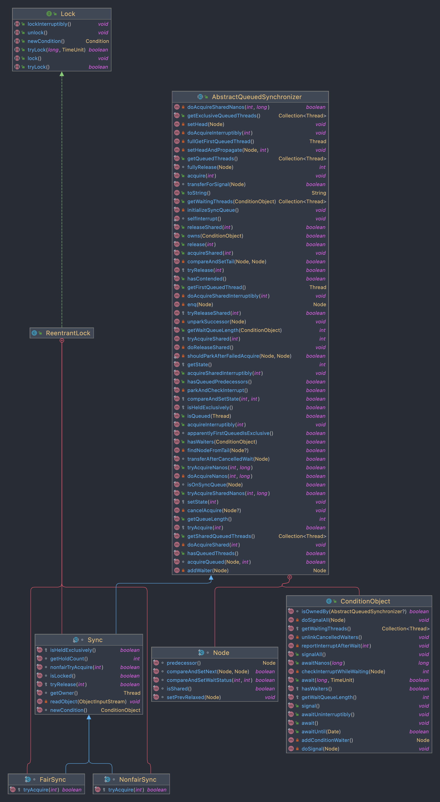
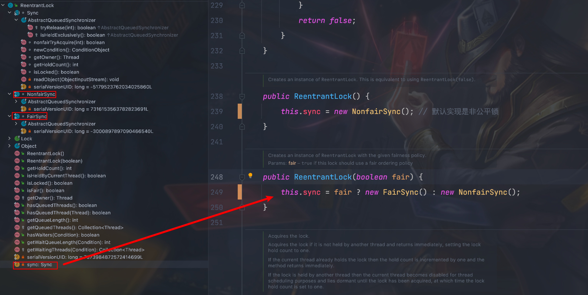
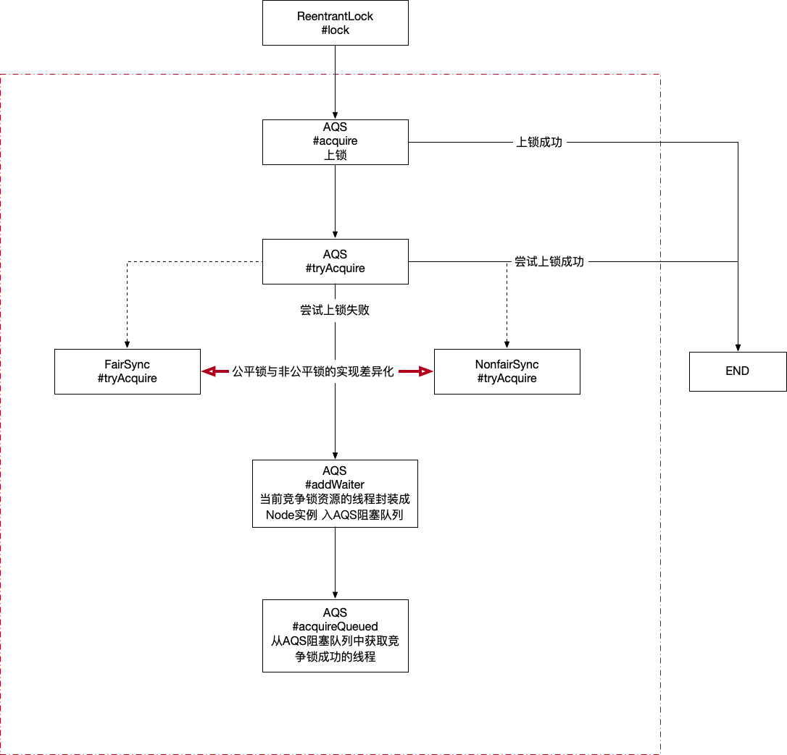

### 摘要

- AQS是什么
- 使用方式
- 源码原理

 

### AQS是什么

摘自java doc，简而言之就是该类基于阻塞队列为同步锁的实现提供了框架功能

```java
Provides a framework for implementing blocking locks and related synchronizers (semaphores, events, etc) that rely on first-in-first-out (FIFO) wait queues.
```

从注释描述以及类名AbstractQueuedSynchronizer可预见的几个特点 

1. 该类是个抽象类，使用了模板方法的设计模式定义了整体框架功能，预留了一部分接口的空实现或者抽象方法延迟到子类实现
2. 实现了队列功能
3. 线程同步临界资源

 

### 使用方式

```java
public class MyLock {

    public static void main(String[] args) {
        long tid = Thread.currentThread().getId();
        MyLock myLock = new MyLock();
        myLock.lock();
        try {
            System.out.println("[" + tid + "]上锁");
            System.out.println("[" + tid + "] thread running...");
            try {
                Thread.sleep(3_000);
            } catch (InterruptedException e) {
            }
        } finally {
            System.out.println("[" + tid + "]去锁");
            myLock.unLock();
        }
    }

    private final MySync mySync = new MySync();

    private static final int step = 1;

    public void lock() {
        this.mySync.acquire(step);
    }

    public void unLock() {
        this.mySync.release(step);
    }

    private static class MySync extends AbstractQueuedSynchronizer {
        /**
         * 尝试获取资源
         * @param arg
         * @return
         */
        @Override
        protected boolean tryAcquire(int arg) {
            int c = super.getState();
            Thread curThread = Thread.currentThread();
            if (c < 0) throw new IllegalArgumentException();
            if (c == 0) {
                // 多线程cas
                if (!super.compareAndSetState(0, arg)) return false;
                else {
                    // 抢锁成功
                    super.setExclusiveOwnerThread(curThread);
                    return true;
                }
            } else {
                // 锁已经被抢占 不支持重入
                if (Objects.equals(curThread, super.getExclusiveOwnerThread()))
                    throw new UnsupportedOperationException();
                else return false;
            }
        }

        /**
         * 尝试释放资源
         * @param arg
         * @return
         */
        @Override
        protected boolean tryRelease(int arg) {
            // 执行线程
            Thread curThread = Thread.currentThread();
            if (!Objects.equals(curThread, super.getExclusiveOwnerThread())) throw new UnsupportedOperationException();
            int c = super.getState();
            if (c == 0 || c - arg != 0) throw new IllegalArgumentException();
            if (!super.compareAndSetState(c, 0)) return false;
            super.setExclusiveOwnerThread(null);
            return true;
        }
    }
}
```

 

### 源码原理

大体的思路是从ReentrantLock这个工具类着手

```java
public class AQSTest {

    // 公平锁
    private static ReentrantLock fairLock = new ReentrantLock(true);
    // 非公平锁
    private static ReentrantLock nonfairLock = new ReentrantLock(false);

    public static void main(String[] args) {

    }

    public void testFairLock() {
        // 上锁
        fairLock.lock();
        try {
            // TODO: 2022/2/17
        } finally {
            // 去锁
            fairLock.unlock();
        }
    }

    public void testNonfairLock() {
        // 上锁
        nonfairLock.lock();
        try {
            // TODO: 2022/2/17
        } finally {
            // 去锁
            nonfairLock.unlock();
        }
    }
}
```

跟踪代码就要有主次先后顺序

- 公平锁和非公平锁的实现差异，公平锁要保证的边界肯定要比非公平锁多的，非公平锁的性能理论上也要优于公平锁的
- 锁重入的实现方式
- 队列的实现方式
- 线程实例的处理方式

 

#### 类图



- Lock定义了ReentrantLock的顶层抽象，我们只关注#lock(...)和#unLock(...)
- ReentrantLock中有3个内部类，FairSync和NonfairSync分别代表着公平锁和非公平锁的实现，他们父类是Sync
- Sync继承自AQS
- AQS中内部类Node

 

#### 构造方法

ReentrantLock中属性sync，构造方法仅仅是指定sync是FairSync还是NonfairSync的实例，默认是NonFairSync



 

#### ReentrantLock#lock(...)方法

 

##### 时序




AQS#acquire(...)

```java
public final void acquire(int arg) {
    if (!this.tryAcquire(arg) &&
        this.acquireQueued(this.addWaiter(Node.EXCLUSIVE), arg))
        this.selfInterrupt(); // 给当前线程设置中断状态 这边给线程设置中断状态 仅仅是为了恢复现场而已 能进到这个分支说明在acquireQueued()方法中检测到这个线程曾经被设置过ture的中断状态 但是彼时为了for轮询抢锁的过程中不至于耗死cpu 没有编程式响应中断 但是把中断状态抹除了 现在再根据当时的状态还原
}
```

 

#####  FairSync#tryAcquire(...)

```java
protected final boolean tryAcquire(int acquires) { // 线程尝试上锁 2种情况可以尝试上锁成功 第一:无锁状态 没有其他线程在等待 第二:重入线程
    final Thread current = Thread.currentThread();
    int c = getState();
    if (c == 0) { // state=0 无锁状态
        if (!super.hasQueuedPredecessors() && // 这个地方体现了公平锁的概念 对于锁资源的争夺(排除condition队列)有2个地方 一个是AQS之外的线程 一个是AQS阻塞队列中等待资源的节点线程 现在的场景是一个现层有机会获取锁资源 但是要先看看AQS阻塞队列中是不是已经有排队在等待的线程节点 也就是AQS阻塞队列的优先级要高(公平的体现)
            super.compareAndSetState(0, acquires)) { // 没有其他线程等待锁资源 当前线程cas修改锁状态成功 此刻还是存在锁竞争的 所以采用cas方式
            super.setExclusiveOwnerThread(current); // 标识当前持锁线程 通过cas进入分支之后 已经不存在并发
            return true;
        }
    }
    else if (current == super.getExclusiveOwnerThread()) { // state不为0 锁被持有状态 看看当前线程是不是持锁线程
        int nextc = c + acquires;
        if (nextc < 0)
            throw new Error("Maximum lock count exceeded");
        super.setState(nextc); // 修改state标识重入锁次数
        return true;
    }
    return false;
}
```

 

##### NonfairSync#tryAcquire(...)

```java
protected final boolean tryAcquire(int acquires) {
            return super.nonfairTryAcquire(acquires);
        }


final boolean nonfairTryAcquire(int acquires) {
    final Thread current = Thread.currentThread();
    int c = getState();
    if (c == 0) { // 无锁状态
        if (super.compareAndSetState(0, acquires)) { // 非公平锁 不需要管阻塞队列种其他任务线程
            super.setExclusiveOwnerThread(current);
            return true;
        }
    }
    else if (current == getExclusiveOwnerThread()) { // 重入锁
        int nextc = c + acquires;
        if (nextc < 0) // overflow
            throw new Error("Maximum lock count exceeded");
        super.setState(nextc);
        return true;
    }
    return false;
}
```

 

AQS#addWaiter(...)

```java
private Node addWaiter(Node mode) { // 将线程封装成node节点 进入队列中
    Node node = new Node(mode); // 构建node节点(封装了线程)

    for (;;) { // 轮询
        Node oldTail = this.tail;
        if (oldTail != null) { // head节点是当前持锁线程 从head之后有一个算一个都是阻塞等待竞争锁资源的线程 tail节点不为空意味着阻塞队列不为空
            node.setPrevRelaxed(oldTail); // 当前节点的前驱指针指向尾节点
            if (this.compareAndSetTail(oldTail, node)) { // 尾节点更新为当前节点
                oldTail.next = node;
                return node;
            }
        } else { // tail节点为空 意味着当前阻塞队列是空的
            this.initializeSyncQueue();
        }
    }
}
```

 

##### AQS#acquireQueued(...)

```java
final boolean acquireQueued(final Node node, int arg) { // 正常情况该方法返回false 返回的是竞争锁线程的中断状态 true=中断过 false=没有被中断过 一旦检测到某个竞争锁线程被中断过 就对该线程进行中断
    boolean interrupted = false;
    try {
        for (;;) {
            final Node p = node.predecessor();
            if (p == head && this.tryAcquire(arg)) { // p==head说明当前节点虽然已经进入阻塞队列 但它是阻塞队列的第一个节点(head标识的是持锁线程 阻塞队列的节点是从head之后开始算起) 所以当前节点可以尝试去抢一下锁 尝试抢锁的原因(第一它是队头 第二当前的head可能是在初始化阻塞队列的时候调用new Node()创建的 没有设置任何线程 也就是说此刻的head不属于任何线程)
                this.setHead(node); // 当前node设置给head 标识此时持锁线程就是head
                p.next = null; // help GC
                return interrupted; // 返回false表示当前线程不能被中断 没有挂起当前线程 当前线程获锁成功
            }
            if (this.shouldParkAfterFailedAcquire(p, node)) // 当前线程没有抢到锁 判断一下是否需要挂起当前线程 一旦该处返回值为false 会在for轮询中持续进入该方法 最终都是保证前驱节点的waitStatus=-1 前驱节点线程状态正常 将当前节点线程挂起
                interrupted |= this.parkAndCheckInterrupt(); // 挂起当前线程 前驱节点释放锁的时候会唤醒后继节点线程
        }
    } catch (Throwable t) {
        cancelAcquire(node);
        if (interrupted)
            this.selfInterrupt();
        throw t;
    }
}
```

 

#### ReentrantLock#unLock(...)方法