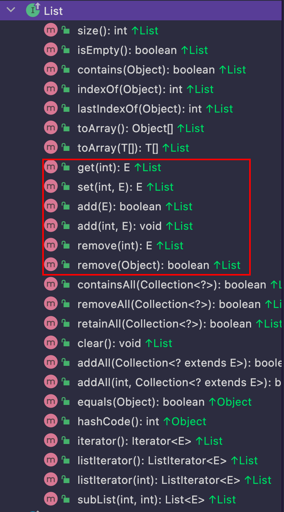

### 解决了什么问题

A thread-safe variant of ArrayList in which all mutative operations (add, set, and so on)

引用CopyOnWriteArrayList的doc就是解决了ArrayList并发场景下对容器的修改安全性问题

 

### 解决方案

涉及修改数组数据或者结构的操作引用副本

 

### 优点

- 实现简单 空间换时间
- 读多写少场景下几乎不存在因为锁导致的性能瓶颈(极端情况下只读不写则跟ArrayList是一样的)

 

### 弊端

- 空间开销
- 数据延迟带来的不一致

 

### 源码

```java
public class CopyOnWriteArrayList<E> implements List<E>, RandomAccess, Cloneable, java.io.Serializable
```


实现跟ArrayList几乎一样，只关注List的几个常用api就行。

 


#### CopyOnWriteArrayList#get(int)

没有对入参的脚标显式代码校验，交给jdk底层数组索引IndexOutOfBoundsException

```java
public E get(int index) {
        return this.elementAt(this.getArray(), index); // 获取数组 根据脚标寻址
}

static <E> E elementAt(Object[] a, int index) {
        return (E) a[index];
}

final Object[] getArray() {
        return this.array;
}
```


#### CopyOnWriteArrayList#set(int, E)

```java
private transient volatile Object[] array; // volatile修饰 jvm语义保证了线程可见性

public E set(int index, E element) {
    synchronized (lock) { // 管程锁保证线程安全
        Object[] es = this.getArray(); // 数组
        E oldValue = this.elementAt(es, index); // index脚标上的值

        if (oldValue != element) { // 直接 <tt>if(oldValue==element) return oldValue;</tt>应该更高效
            es = es.clone(); // 副本
            es[index] = element; // 新值替旧值
        }
        // Ensure volatile write semantics even when oldvalue == element
        this.setArray(es); // 将数组引用指向拷贝的副本
        return oldValue;
    }
}
```


#### CopyOnWriteArrayList#add(E)

```java
public boolean add(E e) {
    synchronized (lock) { // 管程锁
        Object[] es = this.getArray(); // 数组
        int len = es.length;
        es = Arrays.copyOf(es, len + 1); // 拷贝数组
        es[len] = e; // 添加元素到末尾脚标
        setArray(es); // 数组引用指向副本
        return true;
    }
}
```


#### CopyOnWriteArrayList#add(int,E)

```java
public void add(int index, E element) { // 源数组[...] 要在指定idx上增加一个元素e 从idx往后的元素依次后移 [...idx...]
    synchronized (lock) { // 管程锁
        Object[] es = this.getArray(); // 数组
        int len = es.length;
        if (index > len || index < 0)
            throw new IndexOutOfBoundsException(outOfBounds(index, len)); // 脚标检验
        Object[] newElements; // 数组副本
        int numMoved = len - index; // [index+1...]有多少个元素是要往后挪的
        if (numMoved == 0)
            newElements = Arrays.copyOf(es, len + 1); // 新增进来的元素就放在数组最后一个脚标处
        else { // 新增进来的元素放在[0...len-1]数组中间的某个位置上 分两次拷贝idx之前和之后的元素
            newElements = new Object[len + 1]; // 创建一个新的数组
            System.arraycopy(es, 0, newElements, 0, index); // [0...idx-1]
            System.arraycopy(es, index, newElements, index + 1,
                             numMoved); // [idx...len-1]
        }
        newElements[index] = element;
        this.setArray(newElements); // 数组引用变更
    }
}
```


#### CopyOnWriteArrayList#remove(int)

```java
public E remove(int index) {
    synchronized (lock) { // 管程锁
        Object[] es = this.getArray(); // 数组
        int len = es.length;
        E oldValue = elementAt(es, index); // idx上的元素
        int numMoved = len - index - 1;
        Object[] newElements; // 数组副本
        if (numMoved == 0)
            newElements = Arrays.copyOf(es, len - 1); // 要移除的元素就是最后一个脚标len-1 拷贝[0...len-2]
        else {
            newElements = new Object[len - 1]; // 新数组的容量 要移除的元素在(0...len-1)中间
            System.arraycopy(es, 0, newElements, 0, index); // 拷贝[0...idx-1]
            System.arraycopy(es, index + 1, newElements, index,
                             numMoved); // 拷贝[idx+1...len-1]
        }
        this.setArray(newElements); // 数组引用
        return oldValue;
    }
}
```

 

### 总结

- 迭代操作(读)不上锁 不影响性能
- 涉及修改数据或者数据结构的操作(写)(add, set, remove...) => 空间换时间 synchronized{}代码块中的操作就是数据不一致的上限
  - 上锁(synchronized)保证线程安全
  - 不直接操作数据容器，拷贝一份副本进行操作，结束后改变指针引用
- volatile关键字保证存储数据的数组线程可见性