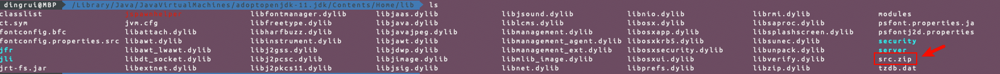
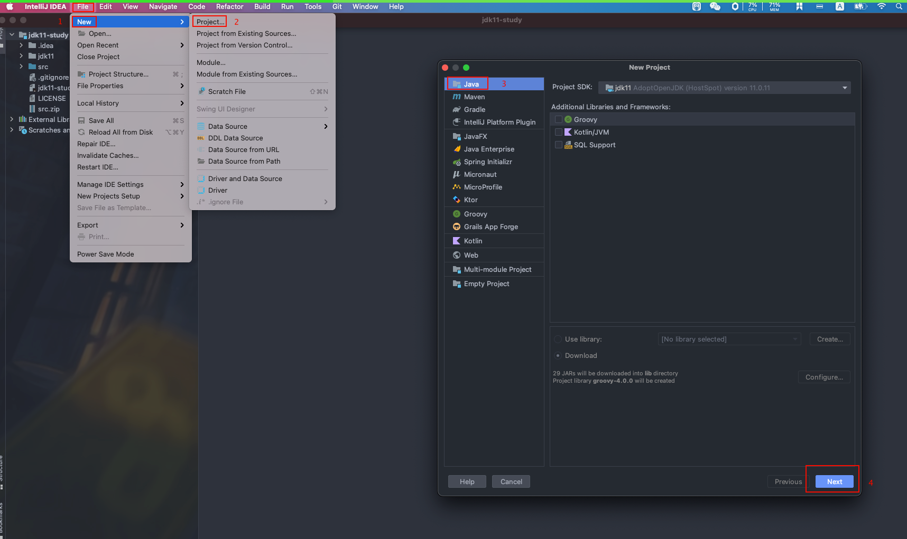
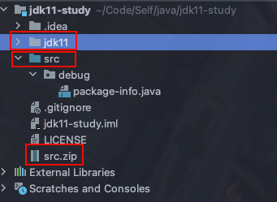
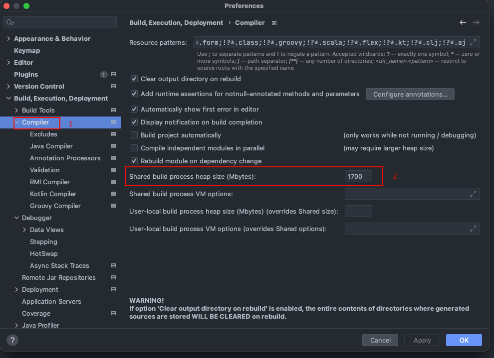
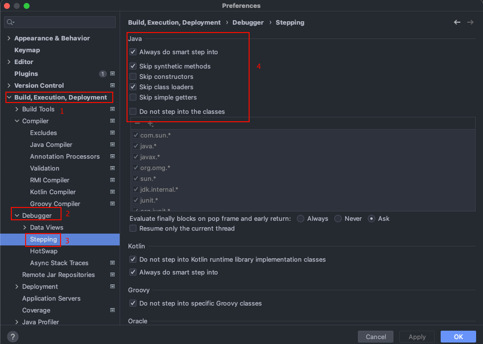
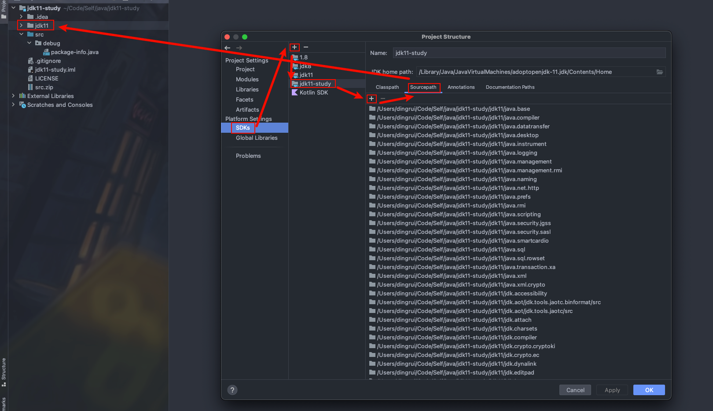
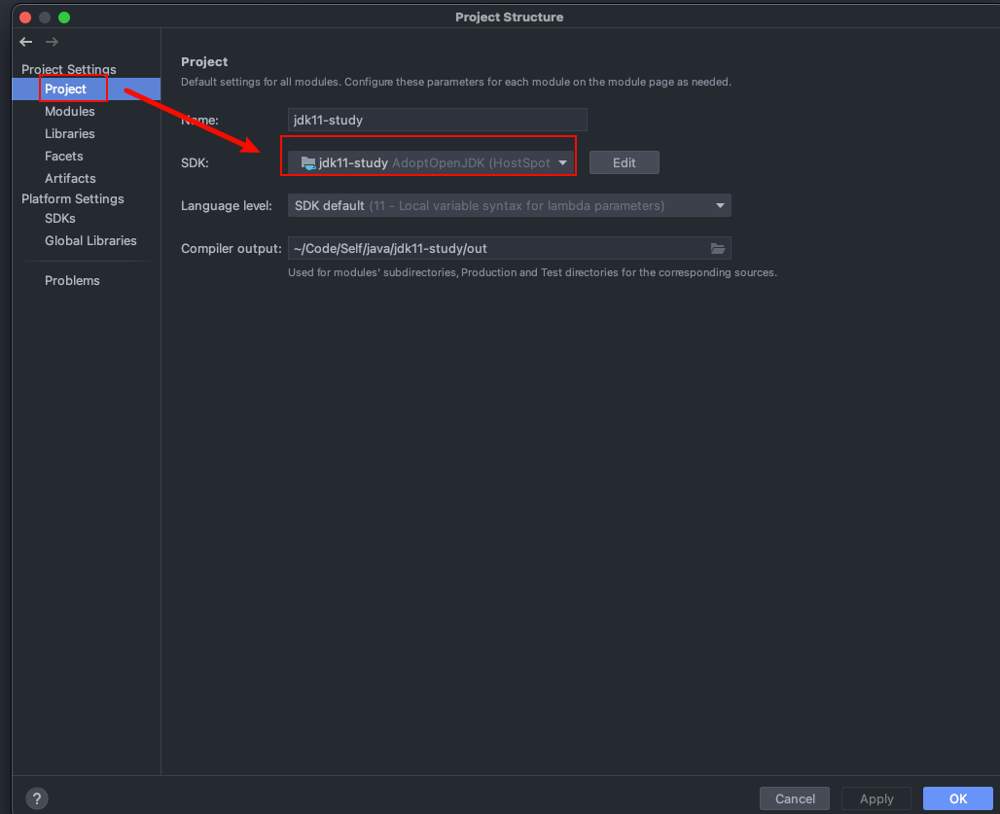
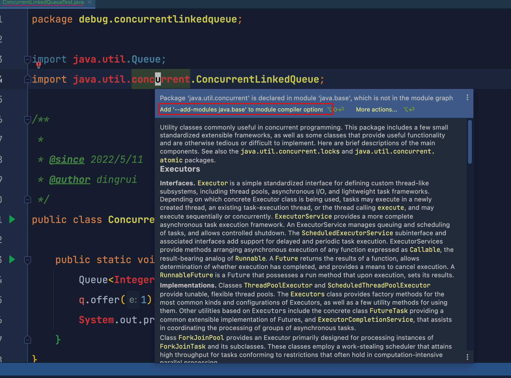
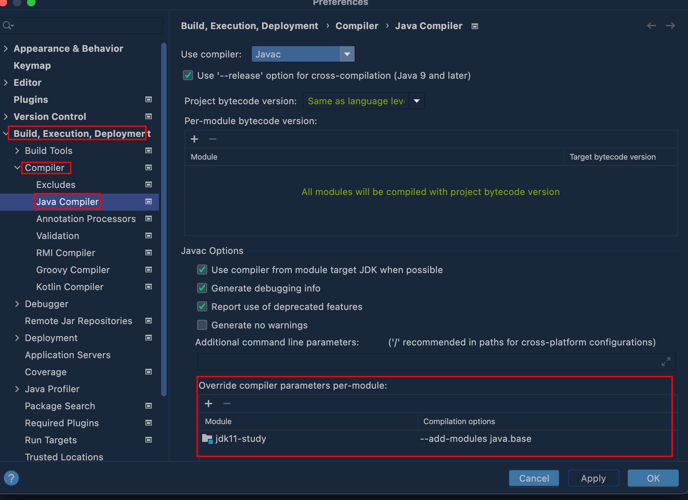

[git地址](https://gitee.com/bannirui/jdk11-study.git)

https://gitee.com/bannirui/jdk11-study.git

 

## **环境**

- macos 11.5.2
- idea 2021.3.1
- jdk adoptopenjdk-11.jdk


## **步骤**

### 1 安装jdk


### 2 源码压缩包

```bash
cd $JAVA_HOME/lib
```




### 3 新建java项目




### 4 导入源码



```bash
项目目录下新建文件夹存放jdk源码 跟项目源码src平级
mkdir jdk11

解压jdk源码压缩包
unzip -d jdk11/ ./src.zip

debug调试代码写在src下
```


### 5 idea设置

#### 5.1 堆内存




#### 5.2 调试




#### 5.3 新增sdk 修改源码路径




#### 5.4 更新项目sdk 选用新增的sdk




#### 5.5 设置编译器(防止无法自动导包)





 