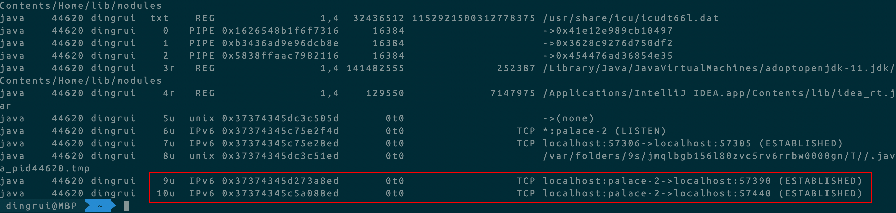

跟网络相关的概念比较多，而且特点都是看不见摸不着，无法形成具象

这个文档就是针对概念记录具体的跟踪过程

 

## 一 TCP握手/挥手

 

### 1 服务端代码

```java
package debug.io.bio.server;

import java.io.BufferedReader;
import java.io.IOException;
import java.io.InputStreamReader;
import java.io.PrintWriter;
import java.net.InetSocketAddress;
import java.net.ServerSocket;
import java.net.Socket;
import java.util.Objects;

/**
 * <p>BIO的服务端</p>
 * @since 2022/5/20
 * @author dingrui
 */
public class ServerSocketTest {

    private static final int PORT = 9992;

    public static void main(String[] args) throws IOException {
        // 创建服务端
        ServerSocket server = new ServerSocket();
        // 绑定端口
        server.bind(new InetSocketAddress(PORT));
        // 监听端口
        Socket socket = server.accept();
        BufferedReader reader = new BufferedReader(new InputStreamReader(socket.getInputStream()));
        PrintWriter writer = new PrintWriter(socket.getOutputStream());
        writer.println("服务端 -> 连接ok");
        writer.flush();

        String msg;
        while (!"bye".equalsIgnoreCase(msg = reader.readLine()) && Objects.nonNull(msg)) {
            System.out.println("客户端 <- " + msg);
            writer.println("服务端 -> " + msg);
            writer.flush();
            msg = null;
        }
        reader.close();
        writer.close();
        socket.close();
        server.close();
    }
}
```

###  

### 2 客户端代码

```java
package debug.io.bio.client;

import java.io.IOException;
import java.io.PrintWriter;
import java.net.InetSocketAddress;
import java.net.Socket;
import java.util.Scanner;

/**
 * <p>BIO客户端</p>
 * @since 2022/5/20
 * @author dingrui
 */
public class SocketTest {

    private static final String IP = "127.0.0.1";
    private static final int PORT = 9992;

    public static void main(String[] args) throws IOException {
        Socket socket = new Socket();
        socket.connect(new InetSocketAddress(IP, PORT));
        PrintWriter writer = new PrintWriter(socket.getOutputStream());
        Scanner scanner = new Scanner(System.in);
        String readLine = "";
        // 线程负责读
        Thread t = new Thread(() -> {
            int size = -1;
            byte[] bytes = new byte[1024];
            StringBuilder sb = new StringBuilder(1024);
            try {
                while ((size = socket.getInputStream().read(bytes, 0, bytes.length)) > 0) {
                    String msg = new String(bytes, 0, size, "UTF-8");
                    sb.append(msg);
                    if (msg.lastIndexOf("\n") > 0) {
                        System.out.println(sb.toString());
                        sb.delete(0, sb.length());
                    }
                    if (Thread.currentThread().isInterrupted()) break;
                }
            } catch (Exception ignored) {
            }
        });
        t.start();

        // main线程写
        while (!readLine.equalsIgnoreCase("bye")) {
            readLine = scanner.nextLine();
            writer.println(readLine);
            writer.flush();
        }

        scanner.close();
        writer.close();
        socket.close();
        t.interrupt();
    }
}
```

 

### 3 网络抓包

 

#### 3.1 命令工具

```
man tcpdump
The general format of a TCP protocol line is:
              src > dst: Flags [tcpflags], seq data-seqno, ack ackno, win window, urg urgent, options [opts], length len
       Src  and  dst  are  the  source and destination IP addresses and ports.  Tcpflags are some combination of S (SYN), F
       (FIN), P (PUSH), R (RST), U (URG), W (ECN CWR), E (ECN-Echo) or `.' (ACK), or `none' if no  flags  are  set.   Data-
       seqno  describes  the  portion  of  sequence space covered by the data in this packet (see example below).  Ackno is
       sequence number of the next data expected the other direction on this connection.  Window is the number of bytes  of
       receive  buffer space available the other direction on this connection.  Urg indicates there is `urgent' data in the
       packet.  Opts are TCP options (e.g., mss 1024).  Len is the length of payload data.
```

 

#### 3.2 网络接口查询

```
sudo tcpdump -D
1.en0 [Up, Running]
2.awdl0 [Up, Running]
3.llw0 [Up, Running]
4.utun0 [Up, Running]
5.utun1 [Up, Running]
6.utun2 [Up, Running]
7.lo0 [Up, Running, Loopback]
8.bridge0 [Up, Running]
9.en1 [Up, Running]
10.en2 [Up, Running]
11.en3 [Up, Running]
12.en4 [Up, Running]
13.pktap0 [Up]
14.gif0 [none]
15.stf0 [none]
16.XHC0 [none]
17.XHC1 [none]
18.ap1 [none]
19.XHC20 [none]
20.VHC128 [none]
```

 

#### 3.3 抓包

```
sudo tcpdump -nn -i lo0 port 9992
客户端->服务端 SYN包 第一次握手
20:01:36.652605 IP 127.0.0.1.62866 > 127.0.0.1.9992: Flags [S], seq 2417007309, win 65535, options [mss 16344,nop,wscale 6,nop,nop,TS val 1282302987 ecr 0,sackOK,eol], length 0

服务端->客户端 SYN ACK包 第二次握手
20:01:36.652676 IP 127.0.0.1.9992 > 127.0.0.1.62866: Flags [S.], seq 149762789, ack 2417007310, win 65535, options [mss 16344,nop,wscale 6,nop,nop,TS val 1504529314 ecr 1282302987,sackOK,eol], length 0

客户端->服务端 ACK包 第三次握手
20:01:36.652707 IP 127.0.0.1.62866 > 127.0.0.1.9992: Flags [.], ack 1, win 6379, options [nop,nop,TS val 1282302987 ecr 1504529314], length 0

20:01:36.652720 IP 127.0.0.1.9992 > 127.0.0.1.62866: Flags [.], ack 1, win 6379, options [nop,nop,TS val 1504529314 ecr 1282302987], length 0

20:01:36.654206 IP 127.0.0.1.9992 > 127.0.0.1.62866: Flags [P.], seq 1:23, ack 1, win 6379, options [nop,nop,TS val 1504529315 ecr 1282302987], length 22
20:01:36.654227 IP 127.0.0.1.62866 > 127.0.0.1.9992: Flags [.], ack 23, win 6379, options [nop,nop,TS val 1282302988 ecr 1504529315], length 0
20:01:44.031065 IP 127.0.0.1.62866 > 127.0.0.1.9992: Flags [P.], seq 1:5, ack 23, win 6379, options [nop,nop,TS val 1282310317 ecr 1504529315], length 4
20:01:44.031132 IP 127.0.0.1.9992 > 127.0.0.1.62866: Flags [.], ack 5, win 6379, options [nop,nop,TS val 1504536644 ecr 1282310317], length 0

客户端->服务端 FIN包 第一次挥手
20:01:44.031836 IP 127.0.0.1.62866 > 127.0.0.1.9992: Flags [F.], seq 5, ack 23, win 6379, options [nop,nop,TS val 1282310317 ecr 1504536644], length 0

服务端->客户端 ACK包 第二次挥手
20:01:44.031862 IP 127.0.0.1.9992 > 127.0.0.1.62866: Flags [.], ack 6, win 6379, options [nop,nop,TS val 1504536644 ecr 1282310317], length 0

服务端->客户端 FIN包 第三次挥手
20:01:44.032483 IP 127.0.0.1.9992 > 127.0.0.1.62866: Flags [F.], seq 23, ack 6, win 6379, options [nop,nop,TS val 1504536645 ecr 1282310317], length 0

客户端->服务端 ACK包 第四次挥手
20:01:44.032565 IP 127.0.0.1.62866 > 127.0.0.1.9992: Flags [.], ack 24, win 6379, options [nop,nop,TS val 1282310318 ecr 1504536645], length 0
```

 

以上可以清晰看出所谓的tcp连接和断开的3次握手和4次挥手

1. tcp包中seq是随机的
2. 对包的确认ack=seq+1
3. 发送过程中将各自的win信息告诉对方，通过窗口机制解决网络拥塞场景下发送速率问题

尝试了几次抓包都发现在3次握手之后，双方建立了tcp连接之后，服务端都会紧随着发一个空包ack包，这个地方留着明白了再回来填坑(todo)

 

## 二 Socket

 

### 1 服务端代码

```java
package debug.io.socket;

import java.io.BufferedReader;
import java.io.IOException;
import java.io.InputStream;
import java.io.InputStreamReader;
import java.net.ServerSocket;
import java.net.Socket;

/**
 *
 * @since 2022/5/20
 * @author dingrui
 */
public class ServerTest {

    public static void main(String[] args) throws IOException {
        ServerSocket server = new ServerSocket(9993);
        System.out.println("new了一个服务端");

        System.in.read();

        while (true) {
            // 接收客户端连接 阻塞
            Socket socket = server.accept();
            new Thread(() -> {
                try {
                    InputStream in = socket.getInputStream();
                    BufferedReader reader = new BufferedReader(new InputStreamReader(in));
                    while (true) {
                        // 读取 阻塞
                        System.out.println(reader.readLine());
                    }
                } catch (Exception ignored) {
                }
            }).start();
        }
    }
}
```

我们将代码阻塞在创建ServerSocket之后，也就是说在程序层面上仅仅做了一件事情，我们观察现象去推导内核做了什么事情

 

### 2 客户端代码

```java
package debug.io.socket;

import java.io.IOException;
import java.io.PrintWriter;
import java.net.InetSocketAddress;
import java.net.Socket;

/**
 * @since 2022/5/20
 * @author dingrui
 */
public class ClientTest {

    private static final String IP = "127.0.0.1";
    private static final int PORT = 9993;

    public static void main(String[] args) throws IOException {
        Socket socket = new Socket();
        socket.connect(new InetSocketAddress(IP, PORT));
        PrintWriter writer = new PrintWriter(socket.getOutputStream());
        String msg = "hello, this is from: " + Thread.currentThread().getId();
        writer.println(msg);
        writer.flush();

        System.in.read();

        writer.close();
        socket.close();
    }
}
```

正常情况下，客户端尝试跟服务端tcp连接之后，发个数据，然后阻塞在这，保持这条连接状态

 

### 3 终端查看文件描述符和网络状态

`jps`查看服务对应的进程号

`sudo lsof -p {pid}`查看进程号信息

####  

#### 3.1 只启动服务端

##### 服务端


当前服务监听着9993这个端口

 

#### 3.2 启动一个客户端

##### 服务端


 

##### 客户端


 

##### netstat


很明显

1. 服务端侧依然只能看到服务端程序在监听着端口，看不到服务端跟某个客户端已经建立了tcp连接
2. 客户端侧可以看到一条跟服务端的tcp连接，本机:51466->本机:9993
3. 服务端其实已经收到了客户端发送的消息，放在了Recv-Q中了

 

#### 3.3 再启动一个客户端

##### 服务端


 

##### 客户端


 

##### netstat


不出所料

1. 服务端侧依然看不到已经建立好的连接
2. 新起的客户端可以看到已经跟服务端建立好了一条tcp连接
3. 客户端已经发了条消息给服务端，服务端也收到了，放在了Recv-Q

 

#### 4 放开服务端代码阻塞



程序能够继续执行下去，在`while`轮询中，两次通过`server.accept()`系统调用向内核获取到了连接的信息，其实就是上面9u和10u两个文件描述符的封装

无论程序是否通过代码显式地向os申请，这两个socket都实实在在存在着

 

### 5 四元组

到此可以再理解一下socket的本质

Socket就是一个四元组，根据源和目标的ip跟port组合出具有唯一性的东西就是socket，对于os而言它一定也是个资源

再回顾下上面的追溯过程，在服务端程序一直阻塞在`Socket socket = ServerSocket#accept()`之前，虽然程序没有继续执行，但是客户端和服务端已经正常建立了tcp连接，并且发送了消息，完成了通信

总结下来就是

1. tcp的连接跟源和目标(ip, port)有关，给定这两个元祖组合出四元组，os就可以创建出来资源(资源的本质应该就是os标识的fd和分配的内存)
2. 消息会有对应的内存缓存区域存放，这些操作托管给了os的内核完成
3. 用户程序的`Socket socket = ServerSocket#accept()`并不是对tcp本身进行干涉，而是通过sc向os的内核获取建立好的tcp连接的fd，然后java将内核返回的已经建立好的tcp连接的一个fd封装成Socket对象
4. 之后用户程序依赖于scoket对象的操作(读写)都是跟内核获取交互内存信息而已(Recv-Q、Send-Q)

 

### 6 ServerSocket构造参数backlog

```java
public ServerSocket(int port, int backlog) throws IOException {
    this(port, backlog, null);
}
```

`ServerSocket`的构造方法提供了`backlog`参数，根据doc描述`requested maximum length of the queue of incoming connections`可以看出是设置了个连接数阈值，支持的最大连接请求数=backlog+1

 

代码验证一下

```java
package debug.io.socket;

import java.io.IOException;
import java.net.ServerSocket;

/**
 *
 * @since 2022/5/21
 * @author dingrui
 */
public class ServerConnectTest {

    public static final int PORT = 9993;

    public static void main(String[] args) throws IOException {
        ServerSocket server = new ServerSocket(PORT, 3);
        System.out.println("new了一个服务端");
        System.in.read();
    }
}
```

 

```java
package debug.io.socket;

import java.io.IOException;
import java.net.InetSocketAddress;
import java.net.Socket;

/**
 *
 * @since 2022/5/21
 * @author dingrui
 */
public class ClientConnectTest {

    public static void main(String[] args) throws IOException {
        for (int i = 0; i < 51; i++) {
            Socket socket = new Socket();
            // 轮询向服务请求连接 当达到服务端设置的backlog阈值后 阻塞住
            socket.connect(new InetSocketAddress(ServerTest.PORT));
            System.out.println("申请向服务端的连接");
        }
    }
}
```

 

设置了`backlog`值为3，在客户端代码轮询连接被监听的端口，达到阈值之后`socket.connect()`阻塞住

