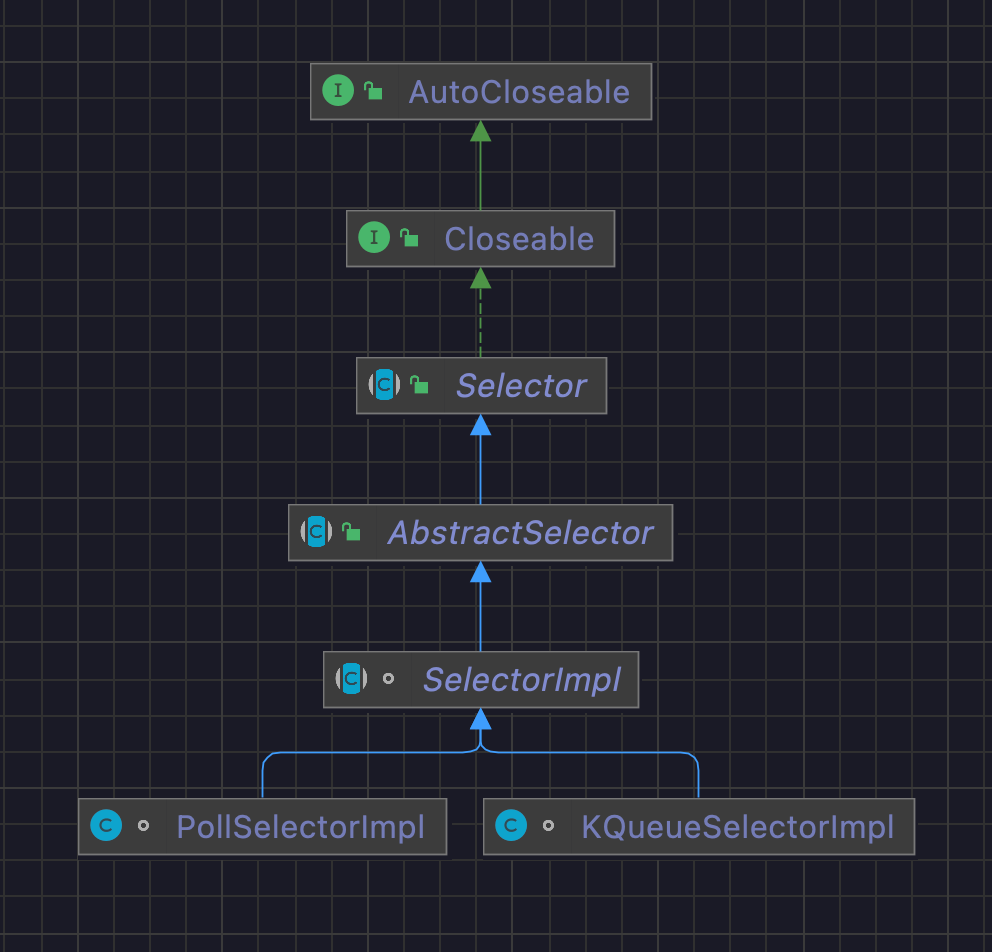
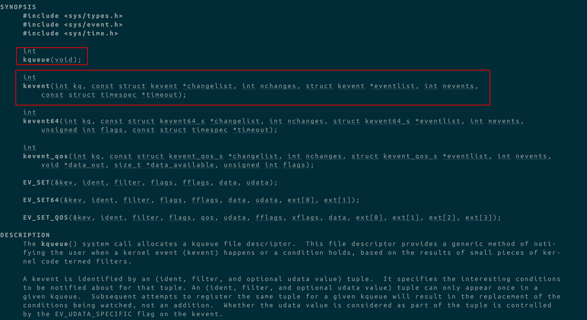

前言

1 多路复用就是os提供了系统调用，能一次性知道多个fd的状态

2 大家都说多路复用的实现有3种 当然下述即使是轮询也是发生在kernel中 效率肯定远远大于在内核外的轮询

* select 数组容量限制fd数量的无差别轮询O(N) 发生内存拷贝
* poll 没有fd数量限制的链表无差别轮询O(N) 发生内存拷贝
* epoll 近乎O(1)时间复杂度


根据已经有的理论知识和猜测跟着源码走一遍(首先承认我的无知，在此之前都是背的八股文，甚至压根不知道macos系统kqueue的实现...)


## 1 Demo

```java
package debug.io.nio;

import java.io.IOException;
import java.net.InetSocketAddress;
import java.nio.channels.SelectionKey;
import java.nio.channels.Selector;
import java.nio.channels.ServerSocketChannel;
import java.util.Iterator;
import java.util.Set;

/**
 * <p>{@link Selector}就是复用器 在java nio下的一种对多路复用的具体实现<ul>
 *     <li>select</li>
 *     <li>poll</li>
 *     <li>epoll</li>
 *     <li>kqueue</li>
 * </ul></p>
 * @since 2022/5/21
 * @author dingrui
 */
public class SelectorTest {

    public static void main(String[] args) throws IOException {
        // 服务端创建 监听端口
        ServerSocketChannel channel = ServerSocketChannel.open();
        channel.configureBlocking(false);
        channel.bind(new InetSocketAddress(9001));

        // 创建一个复用器
        Selector selector = Selector.open();
        channel.register(selector, SelectionKey.OP_ACCEPT); // 把channel注册到复用器
        int ret = selector.select();// 阻塞调用
        Set<SelectionKey> selectionKeys = selector.selectedKeys(); // 拿到事件就绪的channel

        // 以下就是根据业务展开了
        Iterator<SelectionKey> it = selectionKeys.iterator();
        while (it.hasNext()){
            SelectionKey sk = it.next();
            it.remove();
            sk.isValid();
            sk.isWritable();
            sk.isReadable();
            sk.isAcceptable();
        }
    }
}

```

老规矩，用实际的代码带着问题驱动


跟进源码之前先猜测，真正关注的就下面4行，`selector.selectedKeys()`就已经可以获取到有活动的channel了，说明多路复用器的`多路复用`功能体现在前3行

```java
// 创建一个复用器
Selector selector = Selector.open();
channel.register(selector, SelectionKey.OP_ACCEPT); // 把channel注册到复用器
int ret = selector.select();// 阻塞调用
Set<SelectionKey> selectionKeys = selector.selectedKeys(); // 拿到事件就绪的channel
```

先猜测一下

* 创建复用器 -> 无非就是创建一个java bean，可能会设计到属性的初始化和方法块的执行
* 注册 -> 见名知意，把channel绑定到复用器上，入参还有一个事件，那么这个参数的作用要么是在第3行，要么是在第4行
* select()方法 -> 这一行代码应该就是向os获取fd状态的核心
  * 如果实现方式是八股文说的select或者poll，那么os需要一个fd的集合，客户端没有显示传进去，那么就是在这个方法内部获取了连向这个channel的所有socket
  * 如果实现方式是八股文上说的epoll，那么实现细节也就肯定这个方法内部


## 2 源码

就跟着上面4行代码，从结果开始，从下往上的方式跟踪


### 2.1 Set<SelectionKey> selectionKeys = selector.selectedKeys(); // 拿到事件就绪的channel

```java
// SelectorImpl
  
// The set of keys with data ready for an operation
private final Set<SelectionKey> selectedKeys; // 事件就绪的kevent对应的selectionKey <-> publicSelectedKeys

// Public views of the key sets
private final Set<SelectionKey> publicKeys;             // Immutable
private final Set<SelectionKey> publicSelectedKeys;     // Removal allowed, but not addition // Selector#selectedKeys()返回的就是这个集合 <->selectedKeys


@Override
public final Set<SelectionKey> selectedKeys() {
  this.ensureOpen();
  return this.publicSelectedKeys; // 返回了一个集合作为结果 那么只要关注这个集合的生成和添加过程就行
}
```

这个方法很简单，就是直接将一个集合作为结果返回出去了，所以就将注意力放在这个集合的新增上就行


#### 2.1.1 跟踪SelectorImpl#publicSelectedKeys

```java
protected SelectorImpl(SelectorProvider sp) { // 属性初始化工作
  super(sp);
  this.keys = ConcurrentHashMap.newKeySet();
  this.selectedKeys = new HashSet<>();
  this.publicKeys = Collections.unmodifiableSet(keys);
  this.publicSelectedKeys = Util.ungrowableSet(selectedKeys); // 这个就是select()的结果 又自己实现了数据结构 不支持写 相当于读写分离的设计 本质上引用指针指向的是selectedKeys
}
```


看看这个`Util.ungrowableSet(Set)`做了什么

```java
static <E> Set<E> ungrowableSet(final Set<E> s) {
        return new Set<E>() {

                public int size()                 { return s.size(); }
                public boolean isEmpty()          { return s.isEmpty(); }
                public boolean contains(Object o) { return s.contains(o); }
                public Object[] toArray()         { return s.toArray(); }
                public <T> T[] toArray(T[] a)     { return s.toArray(a); }
                public String toString()          { return s.toString(); }
                public Iterator<E> iterator()     { return s.iterator(); }
                public boolean equals(Object o)   { return s.equals(o); }
                public int hashCode()             { return s.hashCode(); }
                public void clear()               { s.clear(); }
                public boolean remove(Object o)   { return s.remove(o); }

                public boolean containsAll(Collection<?> coll) {
                    return s.containsAll(coll);
                }
                public boolean removeAll(Collection<?> coll) {
                    return s.removeAll(coll);
                }
                public boolean retainAll(Collection<?> coll) {
                    return s.retainAll(coll);
                }

                public boolean add(E o){
                    throw new UnsupportedOperationException();
                }
                public boolean addAll(Collection<? extends E> coll) {
                    throw new UnsupportedOperationException();
                }

        };
    }
```

就是自定义了一个`Set`的实现，不支持`add`方法，其他直接调用入参的集合方法

相当于一份数据两处使用，类似读写分离，这个数据的指针指向的是`SelectorImpl#selectedKeys`

那么比较清晰的是

* 客户端在一个`while()`循环里面 通过迭代器拿到一个`SelectionKey`实例后就通过`Set#remove`从`SelectorImpl#selectedKeys`里面移除掉
* 每次进入`Selector#select()`方法，都会往这个集合中添加数据，所以下面就只要关注这个集合的`Set#add()`操作就行


### 2.2 int ret = selector.select();// 阻塞调用

```java
// Selector
public abstract int select() throws IOException; // macos系统 一次系统调用通过kqueue将就绪事件fd对应的SelectionKey都放到集合SelectorImpl#selectedKeys

```


```java
// SelectorImpl
@Override
public final int select() throws IOException {
  return this.lockAndDoSelect(null, -1);
}

private int lockAndDoSelect(Consumer<SelectionKey> action, long timeout)
  throws IOException
{ // 从Selector#select()过来 action=null timeout=-1
  synchronized (this) { // 管程锁
    this.ensureOpen(); // 通过AbstractSelector#selectorOpen标识判断
    if (inSelect) // 线程重入判断
      throw new IllegalStateException("select in progress");
    inSelect = true; // 在同步代码块中修改值 释放锁后修改回去 以此为线程重入的依据
    try {
      synchronized (this.publicSelectedKeys) {
        return this.doSelect(action, timeout);
      }
    } finally {
      inSelect = false;
    }
  }
  
  protected abstract int doSelect(Consumer<SelectionKey> action, long timeout)
    throws IOException; // 实现留给子类关注 macos的实现类在KQueueSelectorImpl

```


这个地方稍微熟悉设计模式就知道一定是模板方法，果断看一下类图




`SelectorImpl`这个抽象类有两处实现`doSelect`，那么一般情况下会搭配策略模式去指定具体的实现，但是有想到八股文上说多路复用的实现跟操作系统有关系，那么这个地方有可能是通过SPI或者类似的方式实现的扩展，但是这个方法调用是无参的，就有可能是在此基础上封装了一个面向客户端的类，使用工厂模式去调用具体实现(先按下不表，以后填坑todo)


通过断点debug，发现macos上的实现是`KQueueSelectorImpl`


#### 2.2.1 KQueueSelectorImpl#doSelect

```java
    @Override
    protected int doSelect(Consumer<SelectionKey> action, long timeout)
        throws IOException
    { // 从Selector#select()跟进来 action=null timeout=-1
        assert Thread.holdsLock(this); // 这个方法是实现了SelectorImpl#deoSelect()预留的模板钩子 入口在SelectorImpl#lockAndDoSelect() 进入之前外面包了synchronized 这个地方再判断一下当前执行线程是否持有了管程锁

        long to = Math.min(timeout, Integer.MAX_VALUE);  // max kqueue timeout // to表示在有超时机制下还有多行时间可用 timeout=-1
        boolean blocking = (to != 0); // true
        boolean timedPoll = (to > 0); // false

        int numEntries;
        this.processUpdateQueue();
        this.processDeregisterQueue();
        try {
            this.begin(blocking);

            do {
                long startTime = timedPoll ? System.nanoTime() : 0; // 0
                numEntries = KQueue.poll(kqfd, pollArrayAddress, MAX_KEVENTS, to); // 本地方法 应该是类似于epoll的一次os sc 阻塞等待系统调用的返回
                if (numEntries == IOStatus.INTERRUPTED && timedPoll) { // 系统调用中断(有可能是超时导致的) 如果客户端设置了超时限制 判定果真超时就将返回值修改为对应的结果
                    // timed poll interrupted so need to adjust timeout
                    long adjust = System.nanoTime() - startTime;
                    to -= TimeUnit.MILLISECONDS.convert(adjust, TimeUnit.NANOSECONDS);
                    if (to <= 0) {
                        // timeout expired so no retry
                        numEntries = 0;
                    }
                }
            } while (numEntries == IOStatus.INTERRUPTED); // os sc返回被中断状态 异常情况下单独判定是否是超时导致的
            assert IOStatus.check(numEntries);

        } finally {
            end(blocking);
        } // 截止目前 从内核拿到了numEntries
        this.processDeregisterQueue();
        return this.processEvents(numEntries, action); // action=null
    }
```

整个方法都没有发现对`SelectorImpl#selectedKeys`的添加操作，跟踪`this.processEvents(numEntries, action)`


```java
    private int processEvents(int numEntries, Consumer<SelectionKey> action)
        throws IOException
    {
        assert Thread.holdsLock(this);

        int numKeysUpdated = 0;
        boolean interrupted = false;

        // A file descriptor may be registered with kqueue with more than one
        // filter and so there may be more than one event for a fd. The poll
        // count is incremented here and compared against the SelectionKey's
        // "lastPolled" field. This ensures that the ready ops is updated rather
        // than replaced when a file descriptor is polled by both the read and
        // write filter.
        this.pollCount++;

        for (int i = 0; i < numEntries; i++) {
            long kevent = KQueue.getEvent(this.pollArrayAddress, i); // 从连续的内存空间上找到对应的kevent
            int fd = KQueue.getDescriptor(kevent); // kevent对应的fd
            if (fd == fd0) {
                interrupted = true;
            } else {
                SelectionKeyImpl ski = fdToKey.get(fd); // 应该是将fd封装成java对象 用户层对对象的读写操作最终映射到os就是那种fd进行操作
                if (ski != null) {
                    int rOps = 0;
                    short filter = KQueue.getFilter(kevent);
                    if (filter == EVFILT_READ) {
                        rOps |= Net.POLLIN;
                    } else if (filter == EVFILT_WRITE) {
                        rOps |= Net.POLLOUT;
                    }
                    int updated = super.processReadyEvents(rOps, ski, action); // rOps=应该是kqueue关注的kevent事件 action=null 过滤出os内核给出的kevent发生过事件变更的
                    if (updated > 0 && ski.lastPolled != pollCount) {
                        numKeysUpdated++;
                        ski.lastPolled = pollCount;
                    }
                }
            }
        }

        if (interrupted) {
            clearInterrupt();
        }
        return numKeysUpdated;
    }
```

*重点mark一下*

* fdToKey是一个map，存放着fd和SelectionKey的映射缓存
* rOps是根据OS kqueue的数据结构kevent计算出来的，而每个kevent就是对应着fd，也就是socket


继续跟进`super.processReadyEvents`()方法

```java
    protected final int processReadyEvents(int rOps,
                                           SelectionKeyImpl ski,
                                           Consumer<SelectionKey> action) { // 返回值要么是0 要么是1 rOps是os从kqueue的kevent中拿来的
        if (action != null) {
            ski.translateAndSetReadyOps(rOps);
            if ((ski.nioReadyOps() & ski.nioInterestOps()) != 0) {
                action.accept(ski);
                ensureOpen();
                return 1;
            }
        } else { // action=null
            assert Thread.holdsLock(publicSelectedKeys);
            if (this.selectedKeys.contains(ski)) { // 事件就绪的kevent对应的fd(映射成SelectionKey)已经被缓存过了
                if (ski.translateAndUpdateReadyOps(rOps)) {
                    return 1;
                }
            } else {
                ski.translateAndSetReadyOps(rOps); // 可能会去修改ski#readyOps
                if ((ski.nioReadyOps() & ski.nioInterestOps()) != 0) { // 与操作 readOps是根据rOps来的 interestOps是channel.register()的时候传进来的肯定不是0 也就是说决定socket时候返回给客户端的因素在于这个rOps
                    this.selectedKeys.add(ski); // 处于就绪事件的selectionKey
                    return 1;
                }
            }
        }
        return 0;
    }
```

终于看到关系的那个集合了`this.selectedKeys.add(ski)`，action是一个函数式接口，姑且当作null来处理，不影响


那么这个集合的添加只有一个条件`if ((ski.nioReadyOps() & ski.nioInterestOps()) != 0)`这是一个与操作，首先后半部分肯定不为0，传进来的值是`channel.register(selector, SelectionKey.OP_ACCEPT)`等于16，因此只要前半部分值不是0就是一个候选人


因此，问题来了，这个`skio.niReadyOps()`的返回值是什么，谁会去改变它，跟内核返回socket状态有什么关系

```java
// SelectionKeyImpl

private volatile int readyOps;
```

这个值仅仅是`SelectionKeyIml`的一个属性

好运是这个属性的修改只有一个方法

```java
// SelectionKeyImpl

public void nioReadyOps(int ops) {
        this.readyOps = ops;
    }
```


跟踪下去发现这个值就是`ski.translateAndSetReadyOps(rOps)`这行代码可能会去做的修改

```java
// ServerSocketChannelImpl

public boolean translateReadyOps(int ops, int initialOps, SelectionKeyImpl ski) {
        int intOps = ski.nioInterestOps();
        int oldOps = ski.nioReadyOps();
        int newOps = initialOps;

        if ((ops & Net.POLLNVAL) != 0) {
            // This should only happen if this channel is pre-closed while a
            // selection operation is in progress
            // ## Throw an error if this channel has not been pre-closed
            return false;
        }

        if ((ops & (Net.POLLERR | Net.POLLHUP)) != 0) {
            newOps = intOps;
            ski.nioReadyOps(newOps);
            return (newOps & ~oldOps) != 0;
        }

        if (((ops & Net.POLLIN) != 0) &&
            ((intOps & SelectionKey.OP_ACCEPT) != 0))
                newOps |= SelectionKey.OP_ACCEPT;

        ski.nioReadyOps(newOps); // 修改readyOps为newOps
        return (newOps & ~oldOps) != 0;
    }
```


那现在的结论就是: `rOps`这个参数决定着哪些socket是有状态标记返回给客户端的


之前mark了2个东西，现在派上了用场

* fdToKey是一个map，存放着fd和SelectionKey的映射缓存
* rOps是根据OS kqueue的数据结构kevent计算出来的，而每个kevent就是对应着fd，也就是socket


梳理一下，到目前为止，可以得到的结论是

借助于kqueue的api，一次`KQueue.poll()`对应的系统调用获取到一个long型数字，根据开辟好的一个数组首地址，依次轮询这个long，其实就是获取到kqueue给我们的有状态的kevent，我们再根据kevent获取到fd


只要能根据fd获取到所谓的SelectionKeyImpl就一切都解了，问题又回到了`SelectionKeyImpl ski = this.fdToKey.get(fd)`这行代码，看调用栈可以发现这个映射关系是`channel.register()`的时候添加的


### 2.3 channel.register(selector, SelectionKey.OP_ACCEPT); // 把channel注册到复用器

#### 2.3.1 AbstractSelectableChannel

```java
    public final SelectionKey register(Selector sel, int ops, Object att)
        throws ClosedChannelException
    { // ServerSocketChannel.register(selector, SelectionKey.OP_ACCEPT)跟踪进来的 att=null
        if ((ops & ~validOps()) != 0) // 参数校验 确保复用器要关注的事件是有效的
            throw new IllegalArgumentException();
        if (!isOpen()) // 参数校验 确保channel是处于监听状态的
            throw new ClosedChannelException();
        synchronized (regLock) {
            if (isBlocking())
                throw new IllegalBlockingModeException();
            synchronized (keyLock) {
                // re-check if channel has been closed
                if (!isOpen())
                    throw new ClosedChannelException();
                SelectionKey k = this.findKey(sel); // k代表的是注册在sel这个复用器上的channel
                if (k != null) { // channel已经注册过了复用器 这个方法再次被调用可能意味着修改某些参数
                    k.attach(att);
                    k.interestOps(ops);
                } else { // channel向复用器上注册
                    // New registration
                    k = ((AbstractSelector)sel).register(this, ops, att); // channel注册复用器成功后返回的SelectionKey相当于是对channel的封装
                    this.addKey(k); // 把复用器注册成功的channel缓存到keys集合中
                }
                return k;
            }
        }
    }
```

首次进来，肯定是还没注册，自然而然`k = ((AbstractSelector)sel).register(this, ops, att)`


#### 2.3.2 SelectionKeyImpl

```java
    @Override
    public SelectionKey interestOps(int ops) {
        ensureValid();
        if ((ops & ~channel().validOps()) != 0)
            throw new IllegalArgumentException();
        int oldOps = (int) INTERESTOPS.getAndSet(this, ops);
        if (ops != oldOps) {
            this.selector.setEventOps(this); // 把复用器需要关注的事件缓存起来 放到KQueueSelectorImpl#updateKeys中
        }
        return this;
    }
```


#### 2.3.3 KQueueSelectorImpl

```java
    @Override
    public void setEventOps(SelectionKeyImpl ski) {
        ensureOpen();
        synchronized (updateLock) {
            this.updateKeys.addLast(ski); // channel.register(selector, SelectionKey.OP_ACCEPT)触发的 重要 后面找fd跟ski映射之前要用到
        }
    }
```

到这已经出现了一个比较重要的操作了`this.updateKeys.addLast(ski)`，在找fd跟ski的映射之前会有一个动作从updateKeys弹出

这个动作发生在`KQueueSelectorImpl#doSelect()`中的`this.processUpdateQueue()`


### 2.4 Selector selector = Selector.open()

```java
    KQueueSelectorImpl(SelectorProvider sp) throws IOException { // sp是KQueueSelectorProvider的实例
        super(sp);

        this.kqfd = KQueue.create(); // 应该是对应的一次系统调用 The kqueue() system call allocates a kqueue file descriptor.  This file descriptor provides a generic method of notifying the user when a kernel event (kevent) happens or a condition holds, based on the results of small pieces of ker-nel code termed filters
        this.pollArrayAddress = KQueue.allocatePollArray(MAX_KEVENTS); // os实现kqueue定义了kevent数据结构 申请指定数量的kevent内存

        try {
            long fds = IOUtil.makePipe(false);
            this.fd0 = (int) (fds >>> 32); // 高32位 读
            this.fd1 = (int) fds; // 低32位 写
        } catch (IOException ioe) {
            KQueue.freePollArray(pollArrayAddress);
            FileDispatcherImpl.closeIntFD(kqfd);
            throw ioe;
        }

        // register one end of the socket pair for wakeups
        KQueue.register(kqfd, fd0, EVFILT_READ, EV_ADD); // os sc 这个地方猜测应该是调用的这个int kevent(int kq, const struct kevent *changelist, int nchanges, struct kevent *eventlist, int nevents, const struct timespec *timeout);
    }
```

这边就是最简单的了，做了一些属性赋值的准备工作

核心就是在构造方法中体现出了kqueue的调用，应该是发生了两次系统调用

* kqueue()
* kevent()


以下是从手册中查到的资料




## 3 总结

关于多路复用器的一个具体实现java中的Selector就结束了

整个的实现步骤就将文档逆着看

这个复用器的实现依赖的是操作系统macos的kqueue(kqueue我也是第一次见到 具体os实现以后学到了再回来填坑todo)